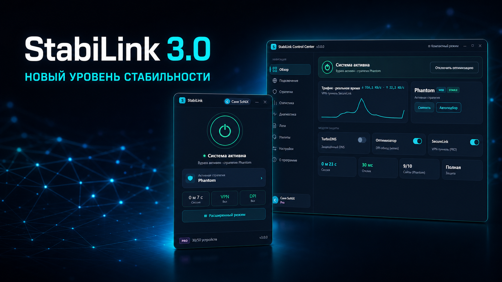

# StabiLink Desktop

Удобное приложение для управления оптимизацией соединения, SecureLink VPN и защищённым DNS в Windows.

[Личный кабинет](https://apps.stabilink.ru) · [Telegram](https://t.me/stabilink) · [Поддержка](https://t.me/stabilink_bot) · [История изменений](CHANGELOG.md)

## StabiLink 3.0

Версия 3.0 получила полностью обновлённый интерфейс: компактное окно для ежедневного управления и StabiLink Control Center со статистикой, настройками и инструментами.

- **Phantom и Game Filter** — оптимизация соединения для чувствительных сервисов, игр и голосовой связи.
- **SecureLink VPN** — защищённое подключение для пользователей PRO.
- **TurboDNS** — защищённые DNS-запросы через DoH.
- **Статистика в реальном времени** — трафик, отклик, активные модули и состояние защиты.
- **Удобное управление** — автозапуск, работа из трея, автоподбор стратегии и обновления без лишних действий.
- **Безопасный вход** — пароль, Telegram и подтверждение устройства по QR-коду.

## Системные требования

- Windows 10 или Windows 11, x64;
- права администратора для управления сетевыми компонентами;
- активное интернет-соединение.

## Скачать

Официальные сборки будут публиковаться на странице **Releases** этого репозитория и в [личном кабинете StabiLink](https://apps.stabilink.ru).

Перед запуском сверяйте номер версии и SHA-256, опубликованный рядом с архивом. Не скачивайте StabiLink из неизвестных источников.

Инструкция: [установка и первый запуск](docs/INSTALL.md).

## Обратная связь

Нашли ошибку — создайте Issue по готовому шаблону. Не прикладывайте токены, QR-коды, ключи доступа, подписочные ссылки или необработанные логи. Для персональной помощи используйте [поддержку](https://t.me/stabilink_bot).

Сообщения об уязвимостях отправляйте по инструкции из [SECURITY.md](SECURITY.md), а не через публичный Issue.

## О репозитории

Это официальный публичный репозиторий релизов, документации и обратной связи. Исходный код StabiLink Desktop здесь не публикуется. Приложение является проприетарным; сторонние компоненты распространяются на условиях их собственных лицензий. Подробнее: [LICENSE.md](LICENSE.md) и [THIRD_PARTY_NOTICES.md](THIRD_PARTY_NOTICES.md).

