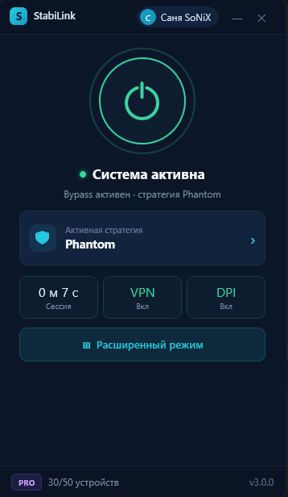
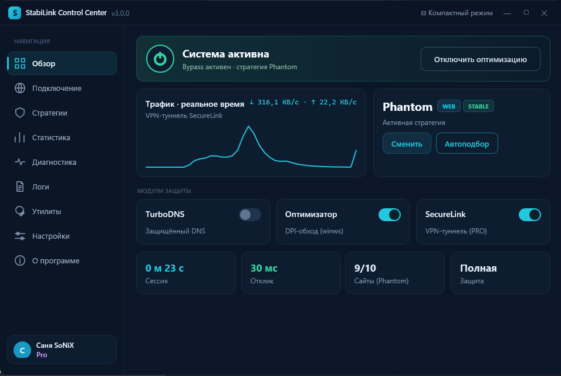
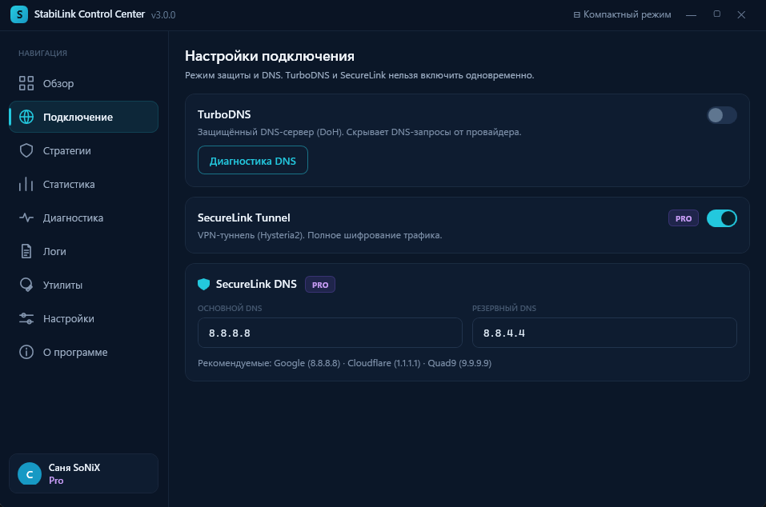
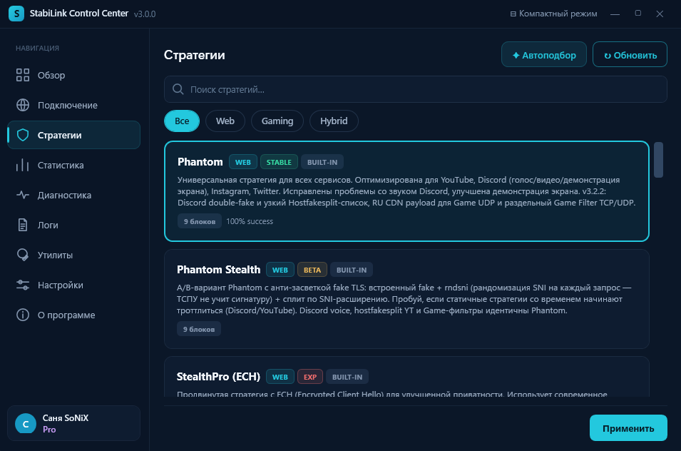
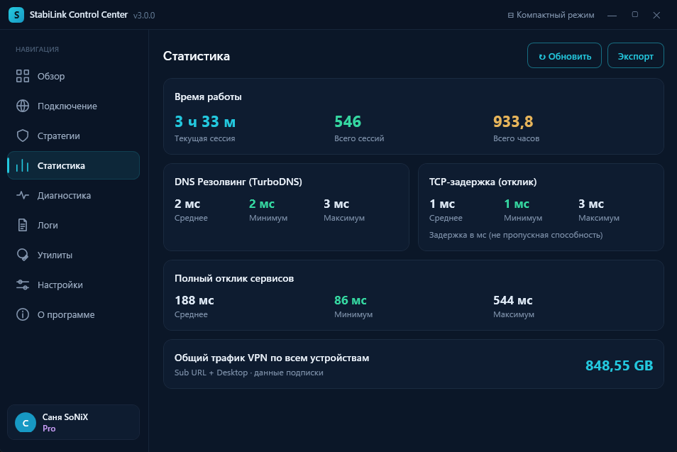
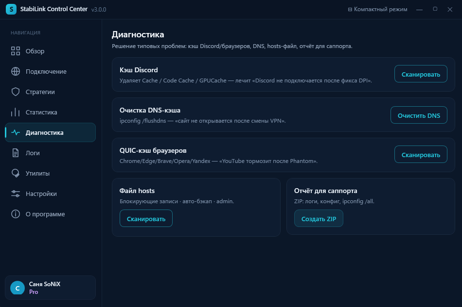
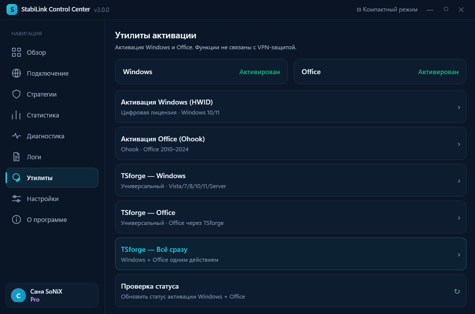
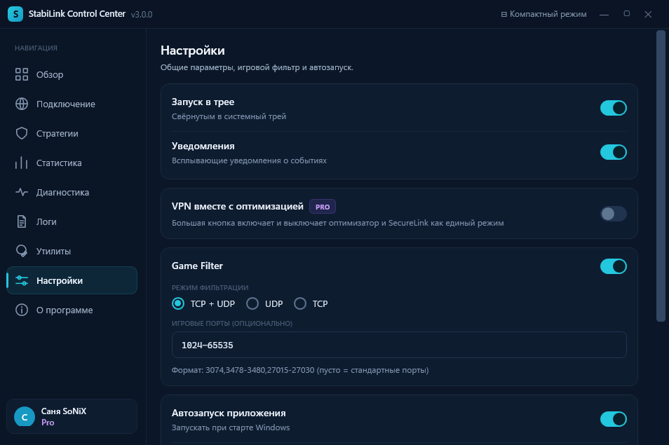

<div align="center">


# StabiLink Desktop

### Единый центр управления оптимизацией соединения, SecureLink VPN и защищённым DNS для Windows

[](https://github.com/sany86russ/StabiLink-Desktop/releases/latest)
[](#системные-требования)
[](#системные-требования)
[](LICENSE.md)

[Скачать](https://github.com/sany86russ/StabiLink-Desktop/releases/latest) ·
[Личный кабинет](https://apps.stabilink.ru) ·
[Новости](https://t.me/stabilink) ·
[Поддержка](https://t.me/stabilink_bot) ·
[Сообщить об ошибке](https://github.com/sany86russ/StabiLink-Desktop/issues/new/choose)

</div>

> [!IMPORTANT]
> Это официальный репозиторий готовых релизов, документации и обратной связи. Исходный код StabiLink Desktop здесь не публикуется. Скачивайте приложение только из раздела Releases или личного кабинета StabiLink.

## Навигация

- [Что такое StabiLink](#что-такое-stabilink)
- [Быстрый старт за 5 минут](#быстрый-старт-за-5-минут)
- [Личный кабинет и Mini-App](#личный-кабинет-и-mini-app)
- [Что появилось в версии 3.0](#stabilink-30)
- [Основные модули](#основные-модули)
- [Варианты работы](#варианты-работы)
- [Интерфейс и скриншоты](#интерфейс-и-скриншоты)
- [Установка](#установка)
- [Первый запуск и четыре способа входа](#первый-запуск-и-авторизация)
- [Как пользоваться](#как-пользоваться)
- [Sub URL для iPhone и Android](#sub-url-для-iphone-и-android)
- [Как получить PRO](#как-получить-pro)
- [Автоматический подбор](#автоматический-подбор-стратегии)
- [Обновления](#обновления)
- [Проверка подлинности](#проверка-подлинности-сборки)
- [Системные требования](#системные-требования)
- [Тарифы FREE и PRO](#free-и-pro)
- [Журналы и приватность](#журналы-и-приватность)
- [Частые вопросы](#частые-вопросы)
- [Используемые проекты и лицензии](#используемые-проекты-и-лицензии)
- [Правовые условия](#правовые-условия)
- [Поддержка](#поддержка-и-обратная-связь)

Подробные материалы:

- [Установка и первый запуск](docs/INSTALL.md)
- [Первый запуск и все способы авторизации](docs/FIRST_START.md)
- [Полный обзор Control Center](docs/CONTROL_CENTER.md)
- [Sub URL для Karing и Happ](docs/SUB_URL.md)
- [Режимы работы и совместимость модулей](docs/MODES.md)
- [Приватность и безопасная передача журналов](docs/PRIVACY_AND_LOGS.md)
- [Расширенный FAQ](docs/FAQ.md)
- [История изменений](CHANGELOG.md)
- [Компоненты и их лицензии](THIRD_PARTY_NOTICES.md)

---

## Что такое StabiLink

StabiLink Desktop — приложение для Windows, которое объединяет управление несколькими сетевыми модулями в одном понятном интерфейсе.

Приложение помогает:

- подобрать подходящую стратегию обработки соединения;
- быстро включать и отключать оптимизацию;
- использовать защищённые DNS-запросы через TurboDNS;
- подключать SecureLink VPN в тарифе PRO;
- видеть текущий трафик, время сессии и состояние модулей;
- управлять автозапуском, треем, уведомлениями и обновлениями;
- проводить диагностику без ручной работы с командной строкой.

StabiLink не является браузером, поисковой системой или каталогом контента. Программа управляет сетевым подключением на устройстве пользователя. Ответственность за соблюдение законодательства, правил сервисов и прав третьих лиц остаётся за пользователем.

---

## Быстрый старт за 5 минут

> [!IMPORTANT]
> Сначала создайте аккаунт в [личном кабинете StabiLink](https://apps.stabilink.ru), а уже затем авторизуйте Windows-компьютер.

1. Зарегистрируйтесь на [apps.stabilink.ru/register](https://apps.stabilink.ru/register) по email и задайте пароль.
2. Скачайте [последний Release](https://github.com/sany86russ/StabiLink-Desktop/releases/latest).
3. Сверьте SHA-256 и полностью распакуйте ZIP.
4. Запустите `StabiLink.Desktop.exe` от имени администратора.
5. Войдите по email и паролю либо привяжите ПК через раздел «Устройства» личного кабинета.
6. Оставьте Phantom и Game Filter включёнными.
7. Нажмите большую кнопку запуска оптимизации.

Для привязки через личный кабинет откройте:

`Устройства` → `Приложение StabiLink` → `Добавить устройство` → `Компьютер / Windows`

Дальше выберите один из вариантов:

- **Код для ввода** — получите одноразовый код в кабинете и введите его во вкладке «TG код» Desktop;
- **Сканировать QR** — откройте QR во вкладке Desktop, отсканируйте его кабинетом и сравните проверочные эмодзи.

Полная пошаговая инструкция: [первый запуск и авторизация](docs/FIRST_START.md).

---

## Личный кабинет и Mini-App

[apps.stabilink.ru](https://apps.stabilink.ru) — единый личный кабинет StabiLink. Он работает в обычном браузере и как Mini-App через [@stabilink_bot](https://t.me/stabilink_bot).

Оба варианта показывают один аккаунт и позволяют:

- зарегистрироваться и войти по email;
- увидеть текущий тариф и срок действия PRO;
- управлять устройствами и свободными слотами;
- привязать StabiLink Desktop кодом или через QR;
- создать персональные Sub URL для Karing/Happ;
- посмотреть общий трафик устройств;
- приобрести или продлить PRO;
- оплатить через СБП, банковскую карту или Telegram Stars;
- скачать Desktop и совместимые мобильные клиенты;
- открыть инструкции для Android/iPhone;
- обратиться в поддержку и следить за ответами;
- управлять аккаунтом и привязкой Telegram.

Telegram не обязателен: если он недоступен, используйте веб-версию личного кабинета, email и пароль или одноразовый email-код.

---

## StabiLink 3.0

Версия 3.0 — самое крупное обновление Desktop-приложения за последнее время.

### Новый интерфейс

- компактное окно для повседневного управления;
- полноценный StabiLink Control Center;
- обновлённые профиль, авторизация и первый запуск;
- единый стиль уведомлений и системного трея;
- понятные состояния Оптимизатора, SecureLink и TurboDNS.

### Удобнее в ежедневной работе

- настройки и автозапуски сохраняются после перезапуска;
- автоматический подбор стратегии можно отменить;
- необязательное обновление разрешено отложить;
- SecureLink можно запускать вместе с оптимизацией одной кнопкой;
- Game Filter включён по умолчанию для совместимых сценариев;
- вход по QR-коду защищён дополнительной проверкой комбинации эмодзи.

### Стабильнее внутри

- аккуратное завершение сетевых процессов и драйвера;
- меньше зависших процессов после выхода;
- плавный график реального трафика;
- корректная статистика при разных сочетаниях модулей;
- чувствительные значения автоматически скрываются в журналах и диагностических архивах.

Полный список: [CHANGELOG.md](CHANGELOG.md).

---

## Основные модули

| Модуль | Назначение | Доступность |
|---|---|---|
| **Оптимизатор** | Применяет выбранную стратегию обработки соединения | FREE и PRO |
| **Phantom** | Основная подготовленная стратегия StabiLink для повседневного использования | FREE и PRO |
| **Game Filter** | Дополнительная обработка соединений игр, голосовой связи и чувствительных сервисов | FREE и PRO |
| **TurboDNS** | Защищённые DNS-запросы через DNS-over-HTTPS | FREE и PRO |
| **SecureLink VPN** | Защищённый VPN-туннель и маршрутизация поддерживаемых сервисов | PRO |
| **Автоподбор** | Проверяет доступные варианты и предлагает наиболее подходящую стратегию | FREE и PRO |
| **Диагностика** | Проверка DNS, подключения, отклика и состояния компонентов | FREE и PRO |

> [!NOTE]
> Результат зависит от провайдера, региона, состояния сети и конкретного сервиса. Ни одна стратегия не может гарантировать одинаковое поведение в любой сети.

---

## Варианты работы

### Только Оптимизатор

Подходит для основного повседневного сценария. StabiLink показывает трафик компьютера, активную стратегию, время сессии и состояние DPI-модуля.

### Оптимизатор + Game Filter

Рекомендуемый вариант для Discord, голосовой связи и игровых соединений. Game Filter находится в настройках и в версии 3.0 включён по умолчанию.

### Оптимизатор + SecureLink VPN

Вариант для пользователей PRO. При включённой настройке «Включать VPN при включении оптимизации» оба модуля запускаются одной основной кнопкой.

### Оптимизатор + TurboDNS

Оптимизация соединения дополняется защищёнными DNS-запросами. В статистике отображается состояние TurboDNS.

### Только SecureLink VPN

SecureLink можно использовать независимо от Оптимизатора. В CompactWindow будет видно, что VPN активен, а оптимизатор выключен.

> [!WARNING]
> TurboDNS и SecureLink VPN используют разные схемы управления DNS и не включаются одновременно. При переключении StabiLink корректно завершает конфликтующий модуль.

Подробнее: [режимы работы и совместимость](docs/MODES.md).

---

## Интерфейс и скриншоты

### CompactWindow

Компактное окно показывает только самое важное: текущее состояние, активную стратегию, сессию, VPN/DNS/DPI и основную кнопку управления.

<div align="center">



</div>

### StabiLink Control Center

Расширенный режим содержит обзор, подключение, стратегии, статистику, диагностику, журналы, утилиты, настройки и сведения о приложении.

<div align="center">



</div>

### Основные разделы Control Center

| Раздел | Что находится внутри |
|---|---|
| **Обзор** | Общее состояние, график трафика, стратегия и быстрые переключатели |
| **Подключение** | TurboDNS, SecureLink VPN и DNS-параметры |
| **Стратегии** | Выбор и применение подготовленной стратегии |
| **Статистика** | Сессия, отклик, доступность сервисов и общий VPN-трафик |
| **Диагностика** | Проверки соединения и компонентов |
| **Логи** | Просмотр, экспорт, обновление и автоматическая очистка журналов |
| **Утилиты** | Вспомогательные сетевые инструменты |
| **Настройки** | Трей, автозапуск, уведомления, Game Filter и запуск модулей |
| **О программе** | Версия, ссылки и сведения о продукте |

### Подключение: TurboDNS и SecureLink



- **TurboDNS** включает защищённые DNS-запросы и доступен на обоих тарифах.
- **Диагностика DNS** проверяет, отвечает ли DNS и корректно ли открываются домены.
- **SecureLink Tunnel** включает VPN для пользователей PRO.
- **SecureLink DNS** позволяет указать основной и резервный DNS внутри VPN.
- TurboDNS и SecureLink взаимоисключающие: приложение не запускает их одновременно.

### Стратегии



- поиск и категории помогают быстро найти подходящий вариант;
- карточки показывают назначение и статус стратегии;
- «Применить» делает выделенный вариант активным;
- «Обновить» получает актуальный список;
- «Автоподбор» проверяет подготовленные варианты и предлагает подходящий для текущей сети.

Phantom — рекомендуемая универсальная стратегия. Экспериментальные варианты предназначены для отдельных сетевых условий и могут вести себя по-разному у разных провайдеров.

### Статистика



- текущая сессия, общее количество запусков и накопленное время;
- среднее, минимальное и максимальное время DNS-ответа;
- TCP-задержка контрольного соединения;
- полный отклик проверяемых сервисов;
- общий VPN-трафик Desktop и Sub URL устройств;
- обновление показателей и экспорт пользовательского отчёта.

### Диагностика



- **Кэш Discord** — очистка временных файлов при проблемах после смены режима;
- **DNS-кэш** — сброс устаревших локальных DNS-записей;
- **QUIC-кэш браузеров** — очистка временных сетевых данных поддерживаемых браузеров;
- **Файл hosts** — проверка блокирующих записей с резервным копированием;
- **Отчёт для поддержки** — создание диагностического ZIP с маскированием чувствительных категорий данных.

### Утилиты



Страница показывает обнаруженный статус лицензирования Windows и Office и содержит связанные системные действия. Эти функции не относятся к VPN или сетевой оптимизации.

> [!CAUTION]
> Используйте лицензионные функции только при наличии законной лицензии или другого права на соответствующий продукт. StabiLink не предоставляет лицензию Microsoft. Публичная документация не содержит инструкций по несанкционированной активации.

### Настройки



- **Запуск в трее** — открывать приложение свёрнутым;
- **Уведомления** — показывать popup о событиях и ошибках;
- **VPN вместе с оптимизацией** — запускать Оптимизатор и SecureLink одной кнопкой на PRO;
- **Game Filter** — дополнительная обработка TCP/UDP для игровых и голосовых сценариев;
- **Игровые порты** — необязательное ограничение Game Filter заданными портами;
- **Автозапуск приложения** — запуск при входе в Windows;
- **Автозапуск оптимизации** — автоматически включать Оптимизатор;
- **Автозапуск TurboDNS** — включать защищённый DNS;
- **Автозапуск SecureLink** — автоматически подключать VPN на PRO.

Подробное описание каждого элемента: [полный обзор Control Center](docs/CONTROL_CENTER.md).

---

## Установка

1. Откройте [последний релиз](https://github.com/sany86russ/StabiLink-Desktop/releases/latest).
2. Скачайте архив вида `StabiLink-Desktop-vX.Y.Z-win-x64.zip`.
3. Сверьте SHA-256 архива со значением в описании релиза или файле `.sha256`.
4. Полностью распакуйте архив в отдельную папку.
5. Запустите `StabiLink.Desktop.exe`.
6. Подтвердите запрос контроля учётных записей Windows.

Не запускайте приложение непосредственно из ZIP и не заменяйте отдельные EXE/DLL файлами из сторонних источников.

Подробная инструкция: [docs/INSTALL.md](docs/INSTALL.md).

> [!TIP]
> Рекомендуемый каталог — папка без синхронизации облаком и без автоматической очистки. Например: `C:\Program Files\StabiLink` или отдельная пользовательская папка приложений.

---

## Первый запуск и авторизация

### Шаг 1 — аккаунт

До входа в Desktop создайте аккаунт на [apps.stabilink.ru](https://apps.stabilink.ru). Рекомендуемый способ — email и пароль. Этот же аккаунт можно открыть через Mini-App [@stabilink_bot](https://t.me/stabilink_bot).

### Шаг 2 — приветствие

При первом запуске приложение показывает возможности, системные требования и пользовательские условия. После принятия условий откроется окно входа.

### Шаг 3 — выберите один из четырёх способов входа

| Способ | Когда использовать | Что сделать |
|---|---|---|
| **Email + пароль** | Аккаунт уже зарегистрирован | Ввести email и пароль во вкладке «Пароль» |
| **Email-код** | Нужно войти без ввода пароля | Запросить письмо и ввести одноразовый код |
| **QR-код** | Рядом есть телефон с открытым кабинетом | Показать QR в Desktop, отсканировать в разделе «Устройства» и сравнить эмодзи |
| **Код устройства / TG-код** | Удобнее перепечатать короткий код | Получить код в кабинете или Mini-App и ввести во вкладке «TG код» |

### Привязка через личный кабинет

1. Откройте [apps.stabilink.ru/devices](https://apps.stabilink.ru/devices).
2. Выберите «Приложение StabiLink».
3. Нажмите «Добавить устройство».
4. Выберите «Компьютер / Windows».
5. Выберите «Код для ввода» или «Сканировать QR».
6. Завершите подтверждение в Desktop.

При QR-входе обязательно сравните комбинацию эмодзи в Desktop и на странице подтверждения. Если значения различаются или вы не начинали вход — ничего не подтверждайте.

### Шаг 4 — первичные настройки

- оставьте Game Filter включённым для игр и голосовой связи;
- TurboDNS включайте после проверки обычной оптимизации;
- включите запуск в трее и уведомления по желанию;
- пользователи PRO могут включить совместный запуск VPN и Оптимизатора.

Подробности, устранение ошибок входа и лимиты устройств: [docs/FIRST_START.md](docs/FIRST_START.md).

---

## Как пользоваться

### Быстрый запуск

1. Откройте StabiLink.
2. Убедитесь, что выбрана стратегия Phantom.
3. Оставьте Game Filter включённым, если используете Discord или игры.
4. Нажмите основную кнопку включения оптимизации.
5. Дождитесь уведомления об успешном запуске.

### Выбор другой стратегии

1. Откройте Control Center.
2. Перейдите в «Стратегии» или нажмите «Сменить» на обзоре.
3. Выберите подготовленный вариант.
4. Нажмите «Применить».
5. Проверьте нужные сервисы и статистику.

### Использование SecureLink

1. Убедитесь, что аккаунт имеет тариф PRO.
2. Откройте «Подключение» или включите SecureLink на обзоре.
3. Дождитесь статуса подключения.
4. Для совместного запуска откройте настройки и включите «Включать VPN при включении оптимизации».

### Использование TurboDNS

1. Отключите SecureLink, если он активен.
2. Откройте «Подключение».
3. Включите TurboDNS.
4. При необходимости запустите встроенную диагностику DNS.

---

## Sub URL для iPhone и Android

Sub URL — персональная ссылка подписки для подключения через совместимые VPN-клиенты. Это позволяет использовать доступ StabiLink на iPhone и Android через Karing или Happ без установки Desktop-приложения на телефон.

> [!NOTE]
> Sub URL доступен только при активном PRO. Каждый созданный слот считается отдельным устройством из общего лимита 5 устройств.

### Создание слота

1. Откройте [apps.stabilink.ru/devices](https://apps.stabilink.ru/devices) или Mini-App [@stabilink_bot](https://t.me/stabilink_bot).
2. Перейдите в «Устройства».
3. Выберите вкладку «Karing / Happ».
4. Нажмите «Создать первый слот» или «Добавить ещё слот».
5. Назовите устройство, например «Мой iPhone».
6. Скопируйте ссылку либо нажмите кнопку открытия в Karing/Happ.

### Подключение

- **Karing:** нажмите `+` → импорт из буфера обмена → выберите профиль → включите VPN.
- **Happ:** откройте персональную ссылку кнопкой из кабинета либо импортируйте её вручную → включите профиль.
- **iOS:** подтвердите добавление VPN-конфигурации через Face ID/Touch ID/код устройства.
- **Android:** подтвердите системный запрос на создание VPN-подключения.

Не используйте одну ссылку на нескольких телефонах и не отправляйте её другим людям. Для каждого устройства создавайте отдельный слот — так его можно независимо отключить и увидеть его трафик.

Полная инструкция: [Sub URL для Karing и Happ](docs/SUB_URL.md).

---

## Как получить PRO

### FREE — всё необходимое для старта

FREE подходит, если вам нужен StabiLink на основных устройствах без VPN:

- Оптимизатор и Phantom;
- Game Filter;
- TurboDNS;
- автоподбор стратегий;
- безлимитный трафик и отсутствие искусственного ограничения скорости;
- до 2 устройств;
- бесплатно без ограничения срока.

### PRO — единая защита компьютера и телефона

PRO добавляет возможности, которых нет в FREE:

- SecureLink VPN в Desktop;
- запуск VPN и Оптимизатора одной кнопкой;
- персональные Sub URL для Karing/Happ на iPhone и Android;
- до 5 устройств в одном аккаунте;
- общую статистику VPN-трафика всех устройств;
- поддержку мобильных VPN-сценариев;
- приоритетную поддержку;
- остальные возможности FREE остаются доступными.

**Стоимость по текущей конфигурации сервиса: 99 ₽ за 30 дней** при оплате через СБП или банковскую карту. В Telegram доступен вариант **70 Stars за 30 дней**. Актуальная цена всегда показывается перед подтверждением оплаты.

### Покупка PRO

1. Войдите на [apps.stabilink.ru](https://apps.stabilink.ru) или откройте Mini-App [@stabilink_bot](https://t.me/stabilink_bot).
2. Перейдите в раздел «Подписка».
3. Выберите тариф PRO.
4. При наличии введите реферальный код.
5. Выберите СБП, банковскую карту или Telegram Stars.
6. Завершите оплату на защищённой странице платёжного сервиса.
7. Вернитесь в кабинет и дождитесь статуса PRO.
8. Обновите профиль Desktop либо перезапустите приложение, если тариф не появился сразу.

После активации можно включить SecureLink в Desktop и создавать Sub URL слоты. Покупка PRO не требует повторной регистрации.

---

## Автоматический подбор стратегии

Автоподбор последовательно проверяет подготовленные варианты и оценивает доступность целевых сервисов.

- подбор можно отменить в любой момент;
- закрытие окна не оставляет бесконтрольную операцию;
- результат можно проверить перед применением;
- при проблемах с сетью подбор разрешено запустить повторно.

Во время проверки не запускайте параллельно другие сетевые оптимизаторы и не переключайте VPN вручную.

---

## Обновления

StabiLink проверяет наличие новой версии при запуске.

- **Обычное обновление:** появляется закреплённое уведомление и кнопка; обновление можно выполнить сейчас или отложить.
- **Обязательное обновление:** используется, если установленная версия ниже минимально поддерживаемой сервером.
- После подтверждения открывается отдельное окно с этапами загрузки, распаковки, установки и перезапуска.
- Пользовательские настройки и данные авторизации сохраняются при штатном обновлении.

Если обновление не скачивается, используйте ручную установку последнего Release поверх закрытого приложения. Не удаляйте пользовательские файлы без рекомендации поддержки.

---

## Проверка подлинности сборки

Каждый Release содержит:

- production-архив StabiLink Desktop;
- отдельный файл с SHA-256 архива;
- SHA-256 в тексте релиза;
- внутренний `SHA256SUMS.txt` для файлов приложения.

### Проверка через PowerShell

```powershell
Get-FileHash .\StabiLink-Desktop-v3.0.0-win-x64.zip -Algorithm SHA256
```

Полученное значение должно полностью совпасть с опубликованным в релизе.

> [!WARNING]
> Если хеш отличается, не распаковывайте и не запускайте архив. Удалите его и скачайте заново из официального источника.

StabiLink может отображаться в SmartScreen как приложение неизвестного издателя, если сборка не подписана коммерческим сертификатом. Это не отменяет обязательную проверку SHA-256.

---

## Системные требования

| Требование | Значение |
|---|---|
| Операционная система | Windows 10 или Windows 11 |
| Архитектура | x64 |
| Оперативная память | от 4 ГБ |
| Свободное место | от 250 МБ плюс место для журналов и обновления |
| Права | Администратор |
| Сеть | Активное интернет-соединение |

Права администратора необходимы для управления сетевыми настройками и драйвером фильтрации трафика. Манифест приложения запрашивает их при запуске.

---

## FREE и PRO

StabiLink не заставляет покупать PRO ради основной оптимизации: FREE остаётся полноценным стартовым тарифом. PRO нужен тем, кто хочет добавить VPN, подключить телефоны через Sub URL и расширить общий лимит устройств.

| Возможность | FREE | PRO |
|---|:---:|:---:|
| Стоимость | Бесплатно | 99 ₽ / 30 дней или 70 Stars |
| Устройства | До 2 | До 5 |
| Ограничение трафика | Нет | Нет |
| Искусственное ограничение скорости | Нет | Нет |
| Оптимизатор | ✓ | ✓ |
| Phantom и Game Filter | ✓ | ✓ |
| TurboDNS | ✓ | ✓ |
| Автоподбор стратегии | ✓ | ✓ |
| SecureLink VPN | — | ✓ |
| Запуск VPN вместе с оптимизацией | — | ✓ |
| Sub URL для Karing/Happ | — | ✓ |
| iPhone/Android через совместимый VPN-клиент | — | ✓ |
| Общий VPN-трафик всех устройств | — | ✓ |
| Приоритетная поддержка | — | ✓ |

Устройство StabiLink Desktop, Android-приложение и каждый Sub URL слот занимают одно место в общем лимите. Удалённое старое устройство освобождает слот.

Цена и состав тарифов могут изменяться; перед оплатой сверяйте актуальные условия в [разделе подписки](https://apps.stabilink.ru/subscription).

---

## Журналы и приватность

StabiLink ведёт локальные журналы для диагностики запуска, модулей и обновления. Перед записью приложение маскирует чувствительные категории данных, включая токены, ключи, данные авторизации и служебные адреса.

Тем не менее перед публикацией фрагмента журнала:

- используйте встроенный экспорт диагностики;
- повторно просмотрите содержимое;
- не публикуйте QR-коды, подписочные ссылки и данные аккаунта;
- полные журналы отправляйте только в личный канал поддержки.

Подробнее: [приватность и журналы](docs/PRIVACY_AND_LOGS.md).

---

## Частые вопросы

### Почему Windows запрашивает права администратора?

Они нужны для управления DNS, сетевыми процессами и драйвером фильтрации. Без повышения прав часть модулей не сможет работать.

### Почему Discord не подключается при включённом Оптимизаторе?

Проверьте, что Game Filter включён в настройках, затем перезапустите оптимизацию. Если проблема остаётся, выполните автоподбор и приложите очищенную диагностику.

### Можно ли одновременно включить TurboDNS и SecureLink?

Нет. Оба модуля управляют DNS разными способами, поэтому StabiLink считает их взаимоисключающими.

### Почему у FREE отображается DNS, а у PRO — VPN?

CompactWindow показывает доступный для тарифа защитный модуль: TurboDNS для FREE и SecureLink VPN для PRO.

### Можно ли закрыть окно и оставить StabiLink работать?

Да, если включён запуск/сворачивание в трей. Для полного завершения используйте пункт «Выход» в меню трея.

### Где находятся журналы?

Откройте раздел «Логи» в Control Center и нажмите «Открыть папку» либо экспортируйте диагностический архив.

### Обязательно ли использовать Telegram?

Нет. Зарегистрируйтесь на [apps.stabilink.ru](https://apps.stabilink.ru) и используйте email с паролем или одноразовый email-код. Telegram-бот — дополнительный удобный вход в тот же личный кабинет.

### Где получить код для привязки Windows?

Откройте «Устройства» → «Приложение StabiLink» → «Добавить устройство» → «Компьютер / Windows» → «Код для ввода». В Desktop введите его во вкладке «TG код».

### Как подключить iPhone?

Нужен активный PRO. Создайте отдельный Sub URL слот во вкладке «Karing / Happ», установите Karing или Happ и импортируйте персональную ссылку. Подробности находятся в [инструкции Sub URL](docs/SUB_URL.md).

### Сколько устройств можно подключить?

FREE — до 2 устройств, PRO — до 5. Каждый Sub URL слот считается отдельным устройством.

### Можно ли передать Sub URL другу?

Нет. Ссылка персональная и предназначена только для вашего устройства. Для каждого собственного устройства создавайте отдельный слот.

Больше ответов: [docs/FAQ.md](docs/FAQ.md).

---

## Используемые проекты и лицензии

StabiLink использует отдельные сторонние компоненты. Они не являются собственностью StabiLink и продолжают распространяться на условиях своих лицензий.

| Компонент в StabiLink 3.0.0 | Проект | Назначение | Лицензия |
|---|---|---|---|
| winws v72.9 | [bol-van/zapret](https://github.com/bol-van/zapret) | Обработка сетевых пакетов в модуле Оптимизатора | MIT |
| WinDivert 2.2 | [basil00/Divert](https://github.com/basil00/Divert) | Перехват и возврат пакетов в сетевой стек Windows | LGPL v3 либо применимая альтернативная лицензия проекта |
| Cygwin API Library 3.4.10 | [Cygwin](https://cygwin.com/) | Среда выполнения для winws | LGPL v3+ с Cygwin Linking Exception |
| dnsproxy v0.73.2 | [AdguardTeam/dnsproxy](https://github.com/AdguardTeam/dnsproxy) | Локальный DNS-прокси и DoH для TurboDNS | Apache License 2.0 |
| sing-box v1.13.12 | [SagerNet/sing-box](https://github.com/SagerNet/sing-box) | Туннельный движок SecureLink | GPL v3 или более поздняя |
| Wintun 0.14.1 | [WireGuard/Wintun](https://www.wintun.net/) | Виртуальный сетевой адаптер SecureLink | Лицензия официальных prebuilt binaries |

StabiLink не заявляет авторство этих компонентов и не связан с их разработчиками. Упоминание проекта означает только его использование в составе инструментария приложения.

Полные сведения, исходные проекты и требования лицензий: [THIRD_PARTY_NOTICES.md](THIRD_PARTY_NOTICES.md).

---

## Правовые условия

- StabiLink Desktop является проприетарным программным обеспечением.
- Публичный репозиторий не предоставляет лицензию на исходный код приложения.
- Пользователь обязан соблюдать законодательство своей страны, правила используемых сервисов и права третьих лиц.
- Автор и команда StabiLink не управляют действиями пользователя, не выбирают запрашиваемый им контент и не несут ответственности за противоправное использование программы.
- Программа предоставляется «как есть». Доступность конкретных сторонних сервисов не гарантируется.
- Сторонние компоненты сохраняют собственные лицензии и авторские права.

Подробнее: [LICENSE.md](LICENSE.md). Юридический текст рекомендуется дополнительно проверить у профильного специалиста по выбранной юрисдикции.

---

## Поддержка и обратная связь

- Поддержка: [@stabilink_bot](https://t.me/stabilink_bot)
- Новости: [@stabilink](https://t.me/stabilink)
- Личный кабинет: [apps.stabilink.ru](https://apps.stabilink.ru)
- Ошибки: [GitHub Issues](https://github.com/sany86russ/StabiLink-Desktop/issues/new/choose)
- Уязвимости: только по инструкции [SECURITY.md](SECURITY.md)

При обращении укажите версию StabiLink, версию Windows, активные модули и точные шаги воспроизведения. Не публикуйте чувствительные данные.

---

<div align="center">

**StabiLink 3.0 — понятное управление соединением в одном приложении.**

© 2025–2026 StabiLink Team

</div>
