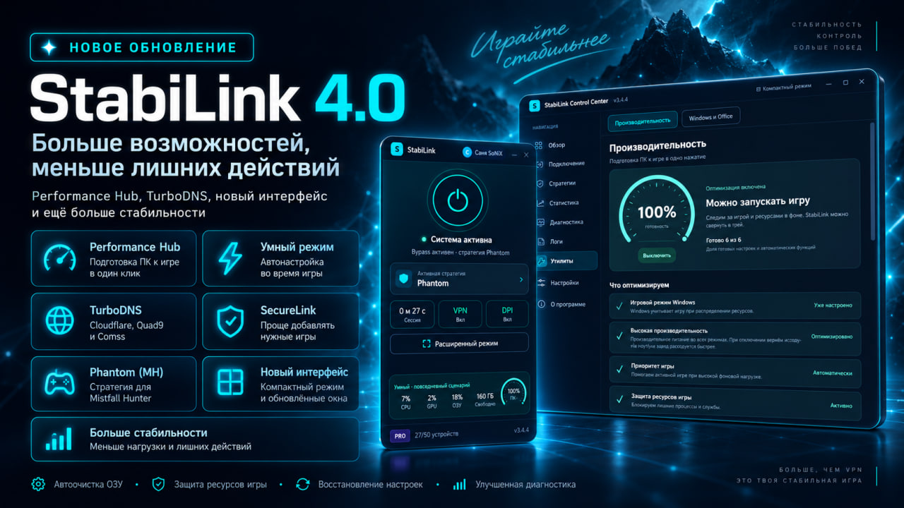
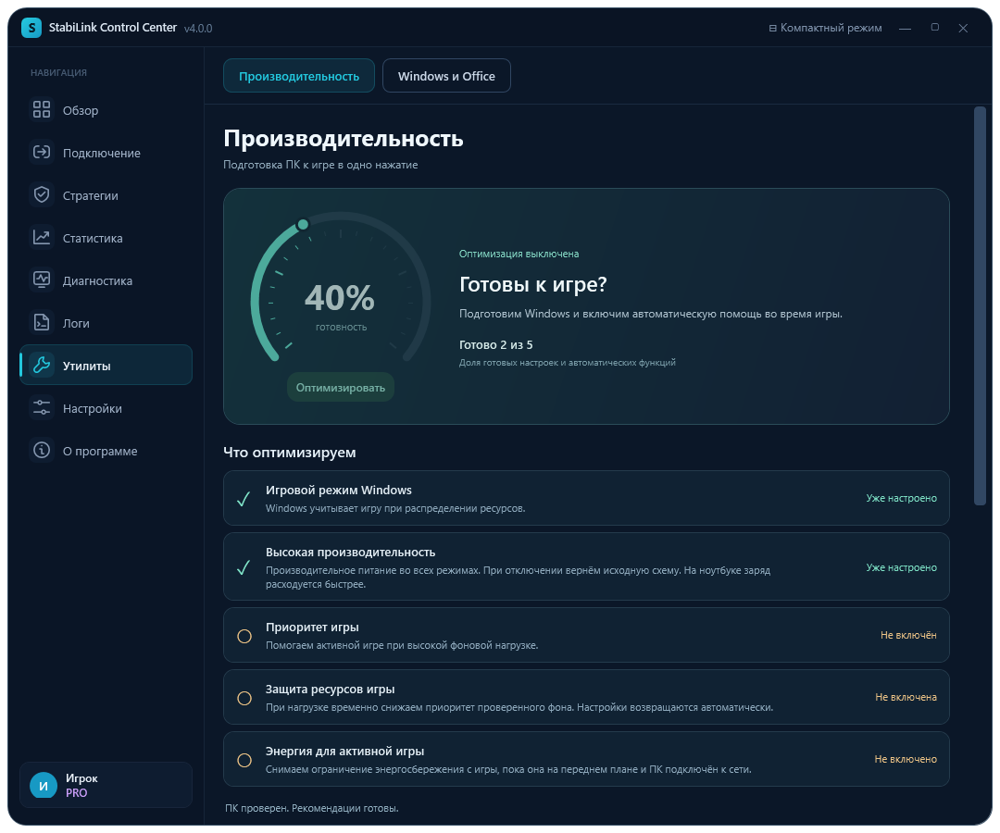
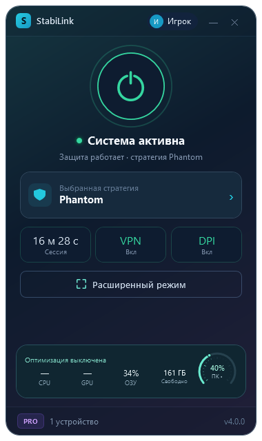
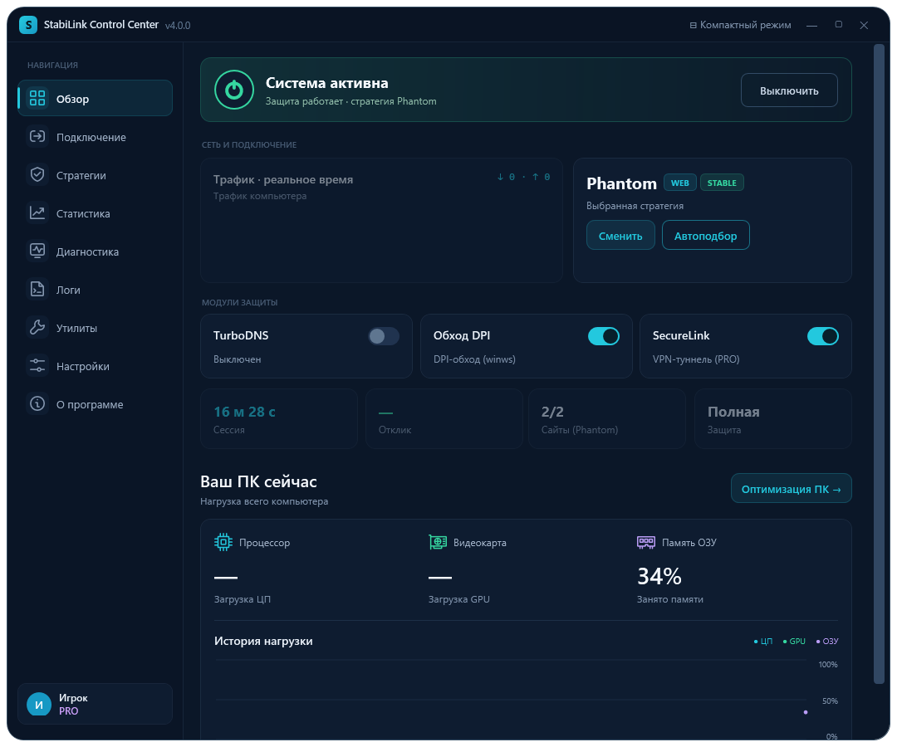
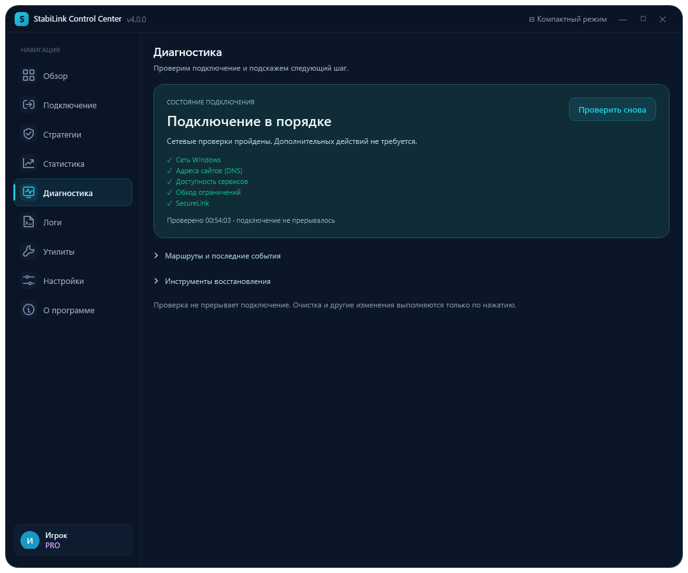
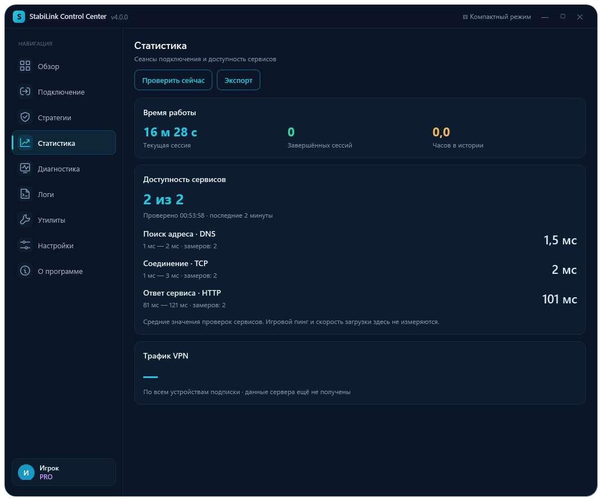
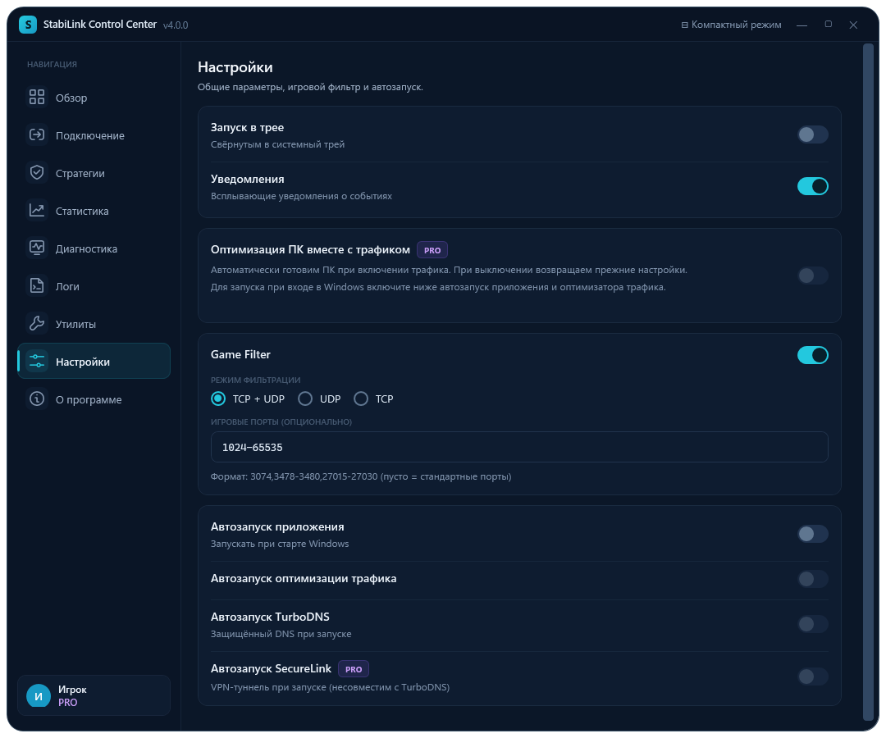

<div align="center">



# StabiLink 4.0

### Стабильное подключение. Подготовка ПК к игре одним нажатием.

[](https://github.com/sany86russ/StabiLink-Desktop/releases/latest)
[](#системные-требования)
[](LICENSE.md)

[**Скачать 4.0.0**](https://github.com/sany86russ/StabiLink-Desktop/releases/tag/v4.0.0) · [**Что нового**](CHANGELOG.md) · [Сайт](https://stabilink.ru) · [Личный кабинет](https://apps.stabilink.ru)

</div>

StabiLink помогает пользоваться Discord, YouTube и другими сервисами, управлять подключением и готовить Windows к играм. Выберите подходящий режим, включите его и занимайтесь своими делами — приложение продолжит работать в трее.

> Это официальный публичный репозиторий готовых релизов, документации и обратной связи. Исходный код StabiLink здесь не публикуется. Загружайте приложение из [Releases](https://github.com/sany86russ/StabiLink-Desktop/releases/latest) или личного кабинета.

## Главное в 4.0

| Новое | Что это даёт вам |
|---|---|
| **Performance Hub · PRO** | Подготовка Windows к игре, управление питанием, очистка ОЗУ и защита ресурсов игры — одной кнопкой. |
| **Умный режим** | Автоматически подстраивается под запуск и завершение игры. Лучше отличает игру от её лаунчера. |
| **Обновлённый TurboDNS** | Выбор DNS-сервиса, увеличенный кэш и более надёжное восстановление после смены сети. Доступен бесплатно. |
| **Удобнее SecureLink** | Быстрее находит игры, отсеивает вспомогательные EXE и проверяет сохранённые правила после обновления. |
| **Phantom (MH)** | Отдельная стратегия подключения для Mistfall Hunter. |
| **Новый интерфейс** | Обновлённый компактный режим, понятная диагностика, новые иконки и меньше лишней работы в фоне. |

[Полный список изменений →](CHANGELOG.md)

## Performance Hub — Оптимизатор ПК

**Включите оптимизацию и запускайте игру.** StabiLink проверяет доступные настройки Windows и применяет подходящие изменения, чтобы освободить ресурсы и помочь уменьшить просадки FPS из-за фоновой нагрузки.

- **Умный режим** определяет игровой сценарий и возвращается к повседневному после завершения игры.
- **Память под контролем:** очистка при включении оптимизации и автоматически при высокой загрузке ОЗУ.
- **Ресурсы для игры:** временное снижение приоритета подходящих фоновых программ при перегрузке компьютера.
- **Производительное питание:** выбор или создание подходящей схемы, если компьютер это поддерживает.
- **Возврат настроек:** при отключении оптимизации восстанавливаются изменённые параметры, питание и временно остановленные службы.



Найдите его в **«Утилиты → Производительность»**. Панель в компактном режиме и индикатор в трее показывают состояние оптимизации. У пользователей PRO подготовка ПК по умолчанию включается вместе с оптимизацией трафика; сохранённый выбор пользователя учитывается.

Процент на спидометре показывает **готовность настроек ПК**, а не прирост FPS. Результат зависит от игры, компьютера и фоновой нагрузки. Разгон видеокарты и ручные замеры кадров для работы функции не нужны.

## Подключение без лишних действий

| Модуль | Для чего нужен |
|---|---|
| **Оптимизатор трафика** | Подготовленные стратегии обработки трафика, включая Phantom. Если текущий вариант не помогает, доступен автоподбор. |
| **Game Filter** | Настройки обработки игрового и голосового трафика. |
| **TurboDNS · FREE и PRO** | Защищённые DNS-запросы через Cloudflare, Quad9 или Comss. Не скрывает IP и не заменяет VPN. |
| **SecureLink · PRO** | VPN-подключение и маршрутизация выбранных игр и приложений. |
| **Sub URL · PRO** | Подключение совместимых клиентов на телефоне — [инструкция Karing](docs/KARING.md). |

TurboDNS и SecureLink работают по отдельности: оба управляют DNS. Оптимизатор трафика может работать совместно с подходящим режимом. Подробнее — [режимы работы](docs/MODES.md).

## Новый интерфейс

Компактное окно оставляет под рукой главное, а расширенный режим даёт доступ ко всем разделам. Обновление можно открыть из обоих окон.

<table>
<tr><th>Компактный режим</th><th>Центр управления</th></tr>
<tr><td width="30%"></td><td></td></tr>
</table>

Скриншоты 4.0 показывают пример интерфейса с демонстрационным аккаунтом. Показания датчиков и состояние подключения могут отличаться на вашем компьютере.

<details>
<summary><b>Диагностика, статистика и настройки</b></summary>

### Диагностика

Проверка запускается автоматически при открытии раздела. Сначала — понятный результат и рекомендуемый следующий шаг; дополнительные инструменты доступны по необходимости.



### Статистика

Время работы, доступность сервисов и результаты проверок разделены. Неизвестные значения не подменяются нулями. Отклик проверяемых сервисов — не игровой пинг и не тест скорости.



### Настройки

Совместный запуск Оптимизатора ПК и трафика, игровой фильтр и автозапуск собраны в одном месте.



</details>

## FREE и PRO

| Возможность | FREE | PRO |
|---|:---:|:---:|
| Оптимизатор трафика, стратегии и Game Filter | ✓ | ✓ |
| TurboDNS с выбором DNS-сервиса | ✓ | ✓ |
| Диагностика, журналы и обновления | ✓ | ✓ |
| SecureLink VPN и маршрутизация процессов | — | ✓ |
| Sub URL для совместимых мобильных клиентов | — | ✓ |
| Performance Hub, автоматическая оптимизация ПК | — | ✓ |
| Панель состояния ПК в компактном режиме и управление оптимизацией в трее | — | ✓ |

Актуальные цены и лимиты устройств смотрите на [сайте StabiLink](https://stabilink.ru) и в [личном кабинете](https://apps.stabilink.ru).

## Быстрый старт

1. Скачайте **`StabiLink-Desktop-v4.0.0-win-x64.zip`** из [релиза 4.0.0](https://github.com/sany86russ/StabiLink-Desktop/releases/tag/v4.0.0).
2. Распакуйте архив в отдельную постоянную папку. Не запускайте приложение прямо из ZIP.
3. Запустите **`StabiLink.Desktop.exe`** и подтвердите запрос Windows на права администратора.
4. Войдите в аккаунт. Для первого входа удобно выбрать **«Email код»** — [подробная инструкция](docs/FIRST_START.md).
5. Выберите **Phantom** и включите Оптимизатор трафика. При необходимости используйте автоподбор.

Уже пользуетесь StabiLink? Откройте уведомление о новой версии. В отдельном окне обновления доступны список изменений, ход загрузки, отмена и повторная попытка при ошибке.

### Проверка подлинности сборки

Рядом с архивом опубликован файл `.sha256`. В PowerShell выполните:

```powershell
Get-FileHash .\StabiLink-Desktop-v4.0.0-win-x64.zip -Algorithm SHA256
```

SHA-256 публичного архива 4.0.0:

```text
d71c54e0974bb3c9234b8cf1be033190a139591d0b084875e1adaa936ba56b2f
```

Если значение не совпадает, скачайте архив заново из официального релиза.

## Системные требования

- Windows 10 или Windows 11, **x64**.
- Права администратора для сетевых и системных функций.
- Подключение к интернету для входа, проверки подписки и обновлений.

Доступность отдельных настроек ПК зависит от Windows, оборудования и политик системы. Работа сетевых стратегий зависит от провайдера и текущих условий подключения.

## Документация и поддержка

- [Установка](docs/INSTALL.md) · [Первый запуск и вход](docs/FIRST_START.md)
- [Центр управления](docs/CONTROL_CENTER.md) · [Режимы подключения](docs/MODES.md)
- [Karing для iPhone и Android](docs/KARING.md) · [Sub URL](docs/SUB_URL.md)
- [Частые вопросы](docs/FAQ.md) · [Журналы и приватность](docs/PRIVACY_AND_LOGS.md)
- [Новости](https://t.me/stabilink) · [Поддержка](https://t.me/stabilink_bot) · [Сообщить об ошибке](https://github.com/sany86russ/StabiLink-Desktop/issues/new/choose)

Перед публикацией журналов уберите личные данные, ссылки подписки и коды входа. О проблемах безопасности сообщайте по [правилам SECURITY](SECURITY.md).

StabiLink — проприетарное приложение. Условия: [лицензия](LICENSE.md), [сторонние компоненты и их лицензии](THIRD_PARTY_NOTICES.md), [правила участия](CONTRIBUTING.md).
