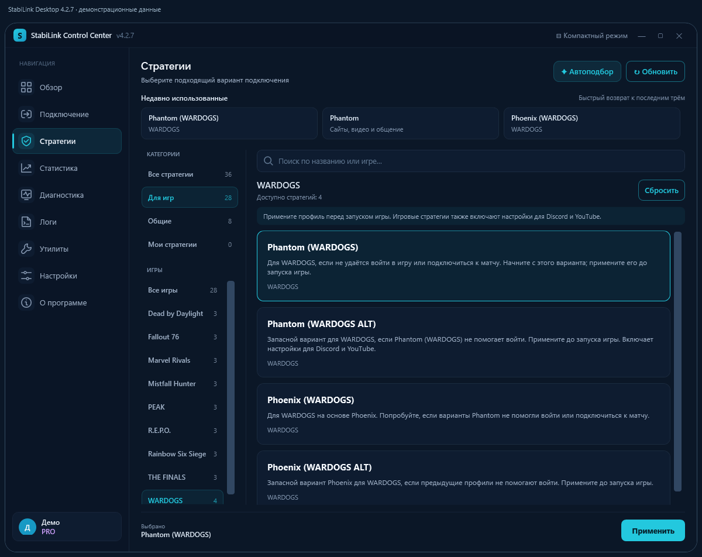
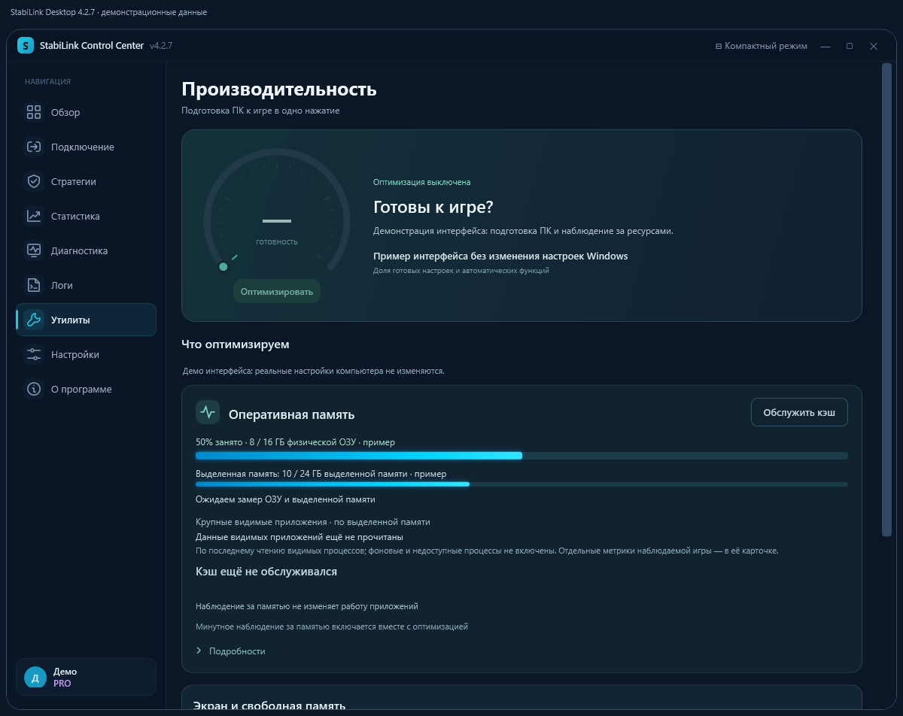
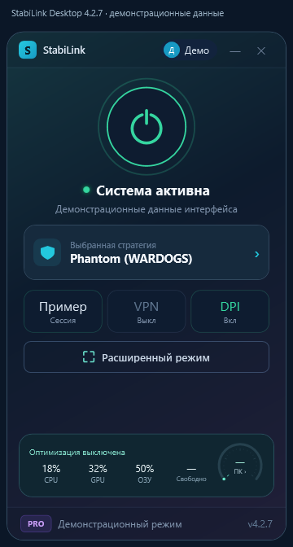
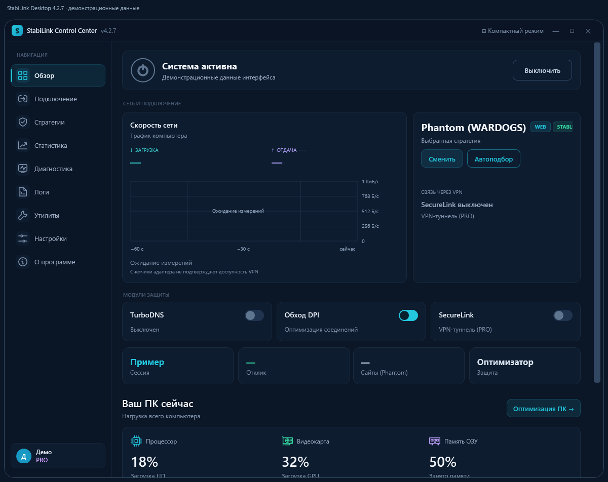

<div align="center">


# StabiLink Desktop — подключение к играм, Discord и YouTube на Windows

**WARDOGS · Mistfall Hunter · PEAK · R.E.P.O. · Fallout 76 · Rainbow Six Siege · Dead by Daylight · Marvel Rivals · THE FINALS**

[](https://github.com/sany86russ/StabiLink-Desktop/releases/latest)
[](#requirements)
[](LICENSE.md)

[**Скачать v4.2.7 для Windows**](https://github.com/sany86russ/StabiLink-Desktop/releases/tag/v4.2.7) · [**Что нового**](CHANGELOG.md#v427) · [**Первый запуск**](docs/FIRST_START.md) · [English](#english) · [Сайт](https://stabilink.ru) · [Личный кабинет](https://apps.stabilink.ru)

</div>

**Игра не подключается к серверу, не пускает в лобби или теряет соединение с матчем?** StabiLink.Desktop объединяет бесплатный Оптимизатор трафика с готовыми игровыми профилями, настройками для Discord и YouTube, диагностикой и обновлениями. В v4.2.7 доступны **36 встроенных стратегий: 8 общих и 28 игровых для 9 игр**. Выберите игру, примените профиль и проверьте подключение.

Для PRO также доступны **SecureLink VPN**, маршрутизация выбранных игр и приложений, **Performance Hub** для подготовки ПК и персональная **Sub URL** для телефона. **TurboDNS** доступен FREE и PRO.

> Официальная публичная витрина StabiLink: готовые Windows-сборки, руководства и обратная связь. Исходный код приложения здесь не публикуется. Скачивайте ZIP из [Releases](https://github.com/sany86russ/StabiLink-Desktop/releases/latest); архивы GitHub «Source code» содержат документацию и не являются установщиком.

<a id="navigation"></a>
## Найти нужное

| Ваша задача | Куда перейти |
|---|---|
| Скачать, установить, войти | [Быстрый старт](#start) · [Установка](docs/INSTALL.md) · [Авторизация](docs/FIRST_START.md) |
| Исправить подключение к игре | [Каталог 9 игр](#games) · [WARDOGS](#wardogs) · [Mistfall Hunter](#mistfall-hunter) · [Порядок проверки](#game-steps) |
| Подключить Discord или YouTube | [Общие стратегии](#strategies) · [Ответы о сервисах](#faq) |
| Выбрать VPN, DNS и совместный режим | [Модули](#modules) · [Совместимость и диагностика](docs/MODES.md) |
| Подготовить ПК к игре | [Performance Hub](#performance) · [Утилиты](docs/CONTROL_CENTER.md#утилиты) |
| Подключить Android или iPhone | [Karing со скриншотами](docs/KARING.md) · [Sub URL](docs/SUB_URL.md) |
| Найти инструкцию или сообщить о сбое | [Все руководства](#docs) · [FAQ](docs/FAQ.md) · [Поддержка](SUPPORT.md) · [Создать Issue](https://github.com/sany86russ/StabiLink-Desktop/issues/new/choose) |

<a id="new"></a>
## Что нового в v4.2.7

**Стабильнее DNS, понятнее диагностика, аккуратнее совместная работа с VPN.** Последний публичный выпуск объединяет доработки ветки 4.2.1–4.2.7:

- **DNS проверяется при запуске Оптимизатора.** При подтверждённой проблеме приложение может временно применить проверенный защищённый DNS, затем проверить результат. Исправный DNS и корпоративные политики сохраняют приоритет.
- **SecureLink восстанавливает DNS после временных сбоев**, корректно обрабатывает разные типы запросов и отдельно проверяет IPv4/IPv6. Результат старой сети не подменяет новую проверку.
- **Phantom и WARDOGS:** обновлён HTTPS-путь Google/YouTube, сохранены отдельные игровые правила и голосовые исключения Discord. Игру, сайты и голос можно проверять в одном сценарии.
- **Split Tunnel:** выбранное приложение направляет через VPN свой IPv4-трафик; IPv6 поддерживается для выбранных доменов и IP-подсетей при поддержке сервера. Прямые исключения остаются прямыми.
- **Performance Hub разделяет физическую и выделенную память, показывает крупные приложения.** Автоматических сбросов кэша по таймеру больше нет; результаты игровой сессии сохраняются после её завершения.
- **Запись проблемы приложения:** ограниченный диагностический сеанс с нагрузкой, памятью, временем ошибки и доступными журналами. Отчёт сохраняется локально, автоматической отправки нет.
- **Надёжнее загрузка обновлений и завершение модулей.** Дополнительные функции автосмены, обучения и группировки пакетов выключены по умолчанию; ускоренный движок не требует их включения.

[Полная история 4.2.1–4.2.7 и SHA-256 →](CHANGELOG.md#v427)



Свежие экраны 4.2.7 показывают настоящий интерфейс с демонстрационными данными. Каталог содержит 36 стратегий для 9 игр и общих сервисов; показатели на иллюстрациях не являются измерениями вашей сети.

<a id="games"></a>
## Игры в StabiLink Desktop: готовые профили подключения

**Все 28 игровых профилей доступны бесплатно.** Подписка PRO для выбора стратегии не нужна. Профиль предназначен для проверки сетевого пути, когда фильтрация трафика мешает входу или соединению. Симптом в таблице помогает выбрать сценарий проверки и сам по себе не устанавливает причину сбоя.

| Игра | Когда попробовать | Профили в v4.2.7 |
|---|---|---|
| [**WARDOGS / Wardogs**](#wardogs) | Ошибка входа, не подключается к матчу, возврат в меню или потеря соединения | Phantom (WARDOGS), Phantom (WARDOGS ALT), Phoenix (WARDOGS), Phoenix (WARDOGS ALT) |
| [**Mistfall Hunter**](#mistfall-hunter) | Сервер недоступен, таймаут входа, разрыв подключения к игре | Phantom (MH), Phoenix (MH), Phantom (MH ALT) |
| [**PEAK**](#coop) | Не получается подключиться к друзьям или теряется связь при входе в лобби | Phantom (PEAK), Phoenix (PEAK), Phantom (PEAK ALT) |
| [**R.E.P.O. / REPO**](#coop) | Ошибка создания комнаты, входа к друзьям или соединения голосового чата | Phantom (R.E.P.O.), Phoenix (R.E.P.O.), Phantom (R.E.P.O. ALT) |
| [**Fallout 76**](#fallout-76) | Потеря связи с сервером при подключении к игровому миру | Phantom (Fallout 76), Phoenix (Fallout 76), Phantom (Fallout 76 ALT) |
| [**Rainbow Six Siege / R6 Siege**](#rainbow-six-siege) | Ошибка соединения **2-0x0000C015** при входе в матч | Phantom (Rainbow Six Siege), Phoenix (Rainbow Six Siege), Phantom (Rainbow Six Siege ALT) |
| [**Dead by Daylight / DBD**](#dead-by-daylight) | Ошибка подключения к сервисам игры, не удаётся войти | Phantom (Dead by Daylight), Phoenix (Dead by Daylight), Phantom (Dead by Daylight ALT) |
| [**Marvel Rivals**](#marvel-rivals) | Загрузка матча зависает на **0%**, не устанавливается соединение | Phantom (Marvel Rivals), Phoenix (Marvel Rivals), Phantom (Marvel Rivals ALT) |
| [**THE FINALS**](#the-finals) | Ошибка **TFGE0001**, проблема связи с сервисом проверки игры | Phantom (THE FINALS), Phoenix (THE FINALS), Phantom (THE FINALS ALT) |

<a id="wardogs"></a>
### WARDOGS: не подключается к матчу, ошибка входа или разрыв соединения

Откройте **«Стратегии → Для игр → WARDOGS»**. Начните с **Phantom (WARDOGS)**, затем по одному сравните **Phantom (WARDOGS ALT)**, **Phoenix (WARDOGS)** и **Phoenix (WARDOGS ALT)**. Применяйте вариант до запуска игры и проверяйте вход и реальный матч.

Профили дают разные способы подключения веб-сервисов и авторизации с отдельными игровыми правилами. Если Wardogs возвращает в меню, сопоставьте точное время сбоя с журналом StabiLink. Очередь, обслуживание или недоступность серверов WARDOGS требуют отдельной проверки.

### Как развивались игровые стратегии

Мы разделяем веб-подключения, авторизацию игры, игровой транспорт и голос. Это позволяет исправлять, например, открытие YouTube в Phantom (WARDOGS), сохраняя отдельные правила WARDOGS и Discord. Доработки опираются на диагностику, точное время сбоя, сравнение профилей и обезличенные данные, которые пользователь передаёт в поддержку.

Порядок работы: **воспроизвести симптом → сопоставить журнал и сетевую проверку → изменить конкретное правило → сравнить результат → сохранить исправление**. Не каждый таймаут требует нового игрового рецепта: причиной могут быть DNS, маршрут провайдера или сервер игры.

Каталог профилей означает поддержку сценария подключения. Он не является обещанием успешного матча у любого провайдера. Последние DNS-доработки проверялись на контрольной сети и в браузере; длительные матчи и голос для каждой игры требуют отдельного сравнения. Мы не выдаём TCP-отклик за игровой ping и не обещаем прирост FPS от сетевого профиля.

<a id="mistfall-hunter"></a>
### Mistfall Hunter: сервер недоступен, таймаут или потеря соединения

Откройте **«Стратегии → Для игр → Mistfall Hunter»** и начните с **Phantom (MH)**. В v4.2.7 доступны ещё **Phoenix (MH)** и **Phantom (MH ALT)**. Поиск по `Mistfall Hunter` находит все три варианта, несмотря на сокращение MH в карточках.

При сообщении «Текущий сервер недоступен», возврате в меню или разрыве связи проверяйте варианты по одному. **UE/Fatal Error, видеодрайвер и ошибки античита** относятся к другим причинам: профиль соединения не исправляет любой вылет Mistfall Hunter.

<a id="coop"></a>
### PEAK и R.E.P.O.: подключение к друзьям, лобби и голосовой чат

Выберите нужную игру и примените её Phantom. Если создание комнаты или вход к друзьям не работает, попробуйте Phoenix, затем Phantom ALT для этой же игры. После смены заново проверьте создание лобби, приглашение друга и голосовую связь. Исправная страница магазина или работающий Discord не подтверждают соединение с кооперативной сессией.

<a id="fallout-76"></a>
### Fallout 76: потеря связи с сервером и вход в мир

В каталоге **Fallout 76** начните с Phantom, затем сравните Phoenix и Phantom ALT. Проверяйте именно вход в игровой мир и дальнейшую сессию. Успешная авторизация в лаунчере не равна исправному соединению игры.

<a id="rainbow-six-siege"></a>
### Rainbow Six Siege: ошибка соединения 2-0x0000C015

Выберите **Rainbow Six Siege**, примените Phantom и повторите вход в матч. Если ошибка 2-0x0000C015 сохраняется, сравните Phoenix и Phantom ALT. Код ошибки не доказывает фильтрацию трафика: также проверьте состояние серверов игры и обычное подключение.

<a id="dead-by-daylight"></a>
### Dead by Daylight: ошибка подключения к сервисам игры

В разделе **Dead by Daylight** доступны Phantom, Phoenix и Phantom ALT. Проверьте вход в DBD и подключение к лобби после применения профиля. При массовом сбое сервисов игры смена локальной стратегии может не помочь.

<a id="marvel-rivals"></a>
### Marvel Rivals: загрузка матча зависает на 0%

Выберите **Marvel Rivals** и сравните три профиля последовательно. Предусмотрена отдельная обработка начала подключения к матчу; первое соединение может занять больше времени. Проверяйте завершение загрузки и игровой процесс, а не только главное меню.

<a id="the-finals"></a>
### THE FINALS: TFGE0001 и конфликт с Оптимизатором

Начните с **Phantom (THE FINALS)**, затем попробуйте **Phoenix (THE FINALS)**. Если игра подключается без Оптимизатора, но перестаёт при его включении, проверьте **Phantom (THE FINALS ALT)**: сервисы игры подключаются напрямую, а общие настройки Discord и YouTube сохраняются. Профиль не отключает проверку игры и не исправляет повреждённые файлы или сбои античита.

<a id="game-steps"></a>
### Как проверить игровой профиль

1. Обновитесь до **v4.2.7** и закройте игру.
2. Откройте **«Стратегии → Для игр»**, выберите игру или найдите её по полному названию.
3. Выберите профиль и нажмите **«Применить»**. Убедитесь, что Оптимизатор включён и выбранный вариант отображается как активный.
4. Запустите игру; проверьте вход, лобби, матч и голосовой чат.
5. Если сбой повторяется, закройте игру и сравните следующий профиль. Меняйте один вариант за раз; настройку SecureLink оставляйте одинаковой при сравнении.
6. Для поддержки запишите игру, профиль, включённые модули, время сбоя с часовым поясом и результат проверки без Оптимизатора. [Как сообщить об ошибке →](SUPPORT.md)

**Автоподбор проверяет восемь общих стратегий; игровые выбираются вручную.** Проверка сайта не подтверждает работоспособность матча. Профили не гарантируют результат у каждого провайдера, не устраняют серверные аварии и не обещают снижения пинга или отсутствия всех обрывов. [Порядок диагностики →](docs/MODES.md)

<a id="strategies"></a>
## Discord и YouTube: общие стратегии Оптимизатора

Оптимизатор работает локально, доступен бесплатно и сам по себе не меняет внешний IP-адрес. Стратегия — готовый набор настроек обработки соединений.

| Семейство | Когда попробовать |
|---|---|
| **Phantom**, **Phantom Stealth** | Начальный выбор для сайтов, видео и голосовой связи |
| **Phoenix**, **Phoenix ALT** | Альтернатива, в том числе при долгой проверке обновлений Discord |
| **Phantom Phoenix**, **Phantom Phoenix ALT** | Гибридные варианты с другим способом веб-подключения Discord |
| **Vector**, **Prism** | Дополнительные способы подключения, если предыдущие варианты не подходят сети |

В **«Общие»** доступны эти восемь стратегий и автоподбор с повторной проверкой. В **«Мои стратегии»** находятся пользовательские профили. Поиск учитывает название, описание и полное название игры; карточки **«Недавно использованные»** помогают вернуться к трём последним применённым вариантам.

Автосмена резервного варианта при сбоях, запоминание удачных вариантов и группировка отправки пакетов доступны как дополнительные настройки и выключены по умолчанию. Ускоренный движок работает независимо от них. Набор возможностей зависит от стратегии; настройки применяются при следующем запуске Оптимизатора. История обучения хранится зашифрованной на компьютере. [Настройки →](docs/CONTROL_CENTER.md#стратегии)

<a id="modules"></a>
## VPN, DNS и управление подключением

| Модуль | Что делает | Доступ |
|---|---|---|
| **Оптимизатор трафика** | Общие и игровые стратегии, автоподбор, резервные способы подключения | FREE / PRO |
| **Game Filter** | Обработка игрового и голосового трафика внутри Оптимизатора | FREE / PRO |
| **TurboDNS** | Защищённые DNS-запросы и кэш адресов; выбор DNS-сервиса | FREE / PRO |
| **SecureLink VPN** | Туннельное подключение и маршруты выбранных игр и приложений | PRO |
| **Performance Hub** | Подготовка Windows к игре и восстановление настроек | PRO |
| **Sub URL** | Персональная подписка для клиентов на Android и iOS | PRO |
| **Диагностика, статистика, журналы** | Проверки сервисов, состояние модулей, данные для поддержки | FREE / PRO |

**SecureLink и TurboDNS включаются по отдельности**, поскольку оба управляют DNS. Оптимизатор может работать с подходящим режимом. В SecureLink можно выбрать установленную игру, её папку или `.exe`; изменения маршрутов применяются при следующем подключении VPN. Маршрутизация через VPN и игровой профиль Оптимизатора — разные настройки. [Матрица совместимости →](docs/MODES.md)

Другие игры также можно выбирать для маршрутизации SecureLink. Это не означает наличие отдельного профиля: встроенный каталог v4.2.7 содержит именно девять игр из [таблицы](#games).

<a id="performance"></a>
## Performance Hub: подготовка Windows к игре

Откройте **«Утилиты → Производительность»**. StabiLink проверяет доступные настройки ПК и применяет подходящие изменения для уменьшения фоновой нагрузки.

- **Умный режим:** игровой сценарий после запуска игры и возврат после завершения.
- **Память:** наблюдение за физической ОЗУ, выделенной памятью и доступным запасом; ручное обслуживание низкоприоритетного кэша при подтверждённой нехватке. Автоматического сброса кэша по таймеру нет.
- **Ресурсы игры:** временное снижение приоритета подходящих фоновых программ при перегрузке.
- **Питание:** выбор или создание подходящей схемы, если компьютер поддерживает её.
- **Возврат настроек:** восстановление параметров, питания и временно остановленных служб при отключении.



У PRO совместный запуск с Оптимизатором трафика включён по умолчанию с учётом сохранённого выбора. Ручное управление также доступно. **Процент готовности на панели — состояние настроек, а не прирост FPS.** Результат зависит от оборудования, игры и фоновой нагрузки. [Центр управления →](docs/CONTROL_CENTER.md)

<a id="interface"></a>
## Компактное окно и Центр управления

Компактное окно оставляет под рукой включение модулей; расширенный режим открывает каталог, маршруты, статистику, диагностику, логи и утилиты. StabiLink продолжает работать в трее.

<table>
<tr><th>Компактное окно</th><th>Центр управления</th></tr>
<tr><td width="30%"></td><td></td></tr>
</table>

[Диагностика](docs/CONTROL_CENTER.md#диагностика) помогает выбрать следующий шаг. [Статистика](docs/CONTROL_CENTER.md#статистика) показывает время работы, трафик и результаты проверок. Отклик сервиса не равен игровому пингу. Неизвестные и устаревшие данные не являются актуальным измерением.

<a id="plans"></a>
## FREE и PRO

Все общие и игровые стратегии, Game Filter, TurboDNS, диагностика и обновления доступны FREE. SecureLink VPN, маршрутизация процессов, Performance Hub и Sub URL входят в PRO.

Актуальные цены, лимиты устройств и условия продления показаны в [личном кабинете](https://apps.stabilink.ru). Для каждого телефона создавайте отдельный слот Sub URL: он занимает место в лимите и позволяет независимо отключить устройство. [Подключить телефон →](docs/KARING.md)

<a id="start"></a>
## Быстрый старт и обновление

1. Скачайте **[StabiLink-Desktop-v4.2.7-win-x64.zip](https://github.com/sany86russ/StabiLink-Desktop/releases/download/v4.2.7/StabiLink-Desktop-v4.2.7-win-x64.zip)** и [файл SHA-256](https://github.com/sany86russ/StabiLink-Desktop/releases/download/v4.2.7/StabiLink-Desktop-v4.2.7-win-x64.zip.sha256).
2. Проверьте хеш и полностью распакуйте ZIP в постоянную папку, например `C:\StabiLink`.
3. Запустите `StabiLink.Desktop.exe` и подтвердите запрос прав администратора.
4. Войдите через **«Email код»**: аккаунт нового пользователя создаётся автоматически. Также доступны пароль, QR и код устройства; Telegram не обязателен. [Все способы входа →](docs/FIRST_START.md)
5. Для Discord и YouTube начните с Phantom или автоподбора. Для игры выберите её профиль в **«Для игр»**, нажмите **«Применить»** и включите Оптимизатор.

```powershell
Get-FileHash .\StabiLink-Desktop-v4.2.7-win-x64.zip -Algorithm SHA256
```

Хеш должен совпасть с `.sha256` этого же релиза. Контрольная сумма подтверждает целостность скачивания; она не заменяет проверку официального источника.

**Уже пользуетесь StabiLink?** Откройте уведомление об обновлении. Перед загрузкой приложение заново проверяет текущую версию, в том числе после ошибки и повторной попытки. Если сервер недоступен, доступна повторная попытка; если обновление уже не нужно, окно сообщит об этом. Штатное обновление сохраняет настройки и вход. [Ручное обновление и удаление →](docs/INSTALL.md)

<a id="requirements"></a>
## Системные требования

- Windows 10 или Windows 11, **x64**.
- Права администратора для сетевых и системных функций.
- Интернет для входа, проверки подписки и обновлений.
- Готовая сборка содержит необходимую среду выполнения .NET.

Доступность настроек ПК зависит от оборудования, Windows и политик системы. При сравнении подключения отключайте сторонние VPN и сетевые фильтры по одному. Не заменяйте DLL, драйверы или EXE вручную файлами из чужих сборок.

<a id="faq"></a>
## Быстрые ответы: игры, Discord и YouTube

### Игра не подключается — нужен ли PRO или VPN?

Для профилей каталога PRO не требуется. Начните с бесплатного игрового профиля. SecureLink — отдельный вариант PRO; включайте его отдельно для проверки маршрута. [Подробнее →](docs/MODES.md)

### Discord зависает на Checking for updates, Starting или RTC Connecting?

После применения стратегии перезапустите Discord. Сравните Phoenix, Phoenix ALT или гибриды Phantom Phoenix, затем используйте автоподбор и диагностику. Проверьте отдельно загрузку клиента, вход и голосовой канал. Работа сайта не доказывает исправность звонка. [FAQ →](docs/FAQ.md#discord-youtube)

### YouTube буферизирует или пишет «Нет подключения к интернету»?

Проверьте другие сайты и диагностику. Используйте автоподбор общих стратегий; Vector и Prism дают дополнительные варианты для сети. Состояние браузера, DNS и общий сбой интернета проверяются отдельно.

### Профиль исправит вылет, античит или снизит пинг?

Профили предназначены для соединений. Они не исправляют любые UE/Fatal Error, ошибки видеодрайверов и античита, не обходят бан аккаунта и не устраняют массовые сбои серверов. Performance Hub работает с ресурсами ПК, но гарантированного роста FPS или снижения пинга нет.

### Почему карточка недавней стратегии не включила её?

Карточка выбирает профиль и открывает его категорию. Для смены нажмите **«Применить»**. История трёх вариантов означает ваш выбор, а не подтверждённую работоспособность соединения.

<a id="docs"></a>
## Все руководства и навигация по GitHub

| Руководство | Что внутри |
|---|---|
| [Установка и обновление](docs/INSTALL.md) | Загрузка, SHA-256, распаковка, обновление, удаление |
| [Первый запуск и вход](docs/FIRST_START.md) | Email-код, пароль, QR, код устройства, первые настройки |
| [Центр управления](docs/CONTROL_CENTER.md) | Каталог, игры, история выбора, VPN-маршруты, утилиты |
| [Режимы и диагностика](docs/MODES.md) | Совместимость VPN/DNS, игровой сценарий, поиск причины сбоя |
| [FAQ](docs/FAQ.md) | Игры, Discord, YouTube, обновления, устройства и аккаунт |
| [Sub URL](docs/SUB_URL.md) | Персональные слоты, импорт, смена и потеря телефона |
| [Karing: Android и iPhone](docs/KARING.md) | Пошаговое подключение со скриншотами |
| [Приватность и журналы](docs/PRIVACY_AND_LOGS.md) | Сбор отчёта и безопасная передача в поддержку |
| [История версий](CHANGELOG.md) | v4.2.7, изменения 4.1 и предыдущие релизы |
| [Публикация релизов](docs/RELEASE_PROCESS.md) | Процесс поставки и проверки готового пакета |

[**Все Releases**](https://github.com/sany86russ/StabiLink-Desktop/releases) · [**Сообщить об ошибке**](https://github.com/sany86russ/StabiLink-Desktop/issues/new/choose) · [Обсуждения](https://github.com/sany86russ/StabiLink-Desktop/discussions) · [Помочь документации](CONTRIBUTING.md)

Для аккаунта, оплаты и полного диагностического архива используйте [личную поддержку](https://t.me/stabilink_bot). О сбоях Desktop сообщайте через GitHub Issues: укажите игру, профиль, модули и время ошибки. Не публикуйте пароли, QR-коды, Sub URL и необработанные журналы. Уязвимости сообщайте по [SECURITY.md](SECURITY.md).

[Новости](https://t.me/stabilink) · [Поддержка](SUPPORT.md) · [Лицензия](LICENSE.md) · [Сторонние компоненты](THIRD_PARTY_NOTICES.md) · [В начало](#navigation)


---

<a id="english"></a>
## StabiLink Desktop — game connectivity, Discord and YouTube on Windows

**Windows 10/11 x64 · 36 strategies · 9 games · Free Optimizer · Optional PRO VPN**

[**Download v4.2.7**](https://github.com/sany86russ/StabiLink-Desktop/releases/tag/v4.2.7) · [Release history](CHANGELOG.md#v427) · [Website](https://stabilink.ru) · [Account](https://apps.stabilink.ru) · [Русский](#navigation)

StabiLink.Desktop brings connection profiles, secure DNS, selective VPN routing, diagnostics and PC preparation into one Windows app. Try a game profile when traffic filtering prevents sign-in, a lobby connection or joining a match. For everyday services, start with the general Phantom strategy or automatic selection.

This is the official public distribution and documentation repository. **StabiLink application source code is private.** Download the ready-to-run ZIP from Releases. GitHub's automatic “Source code” archives contain this documentation and are not application installers.

### What's new in 4.2.7

- Separate IPv4/IPv6 DNS checks and bounded DNS recovery after transient errors.
- Correct handling of DNS query types with SecureLink and split routing; direct and local exceptions retain priority.
- A revised Google/YouTube HTTPS path in Phantom and WARDOGS variants while retaining game and Discord voice rules.
- Clear reporting when a service check succeeds only through a backup CDN endpoint.
- More reliable update downloads and controlled shutdown of networking components.
- Changes since public 4.2.0 also include application problem recording, durable game-session summaries and memory monitoring without automatic cache purges.

### Supported game profiles

All **28 game profiles are free**. Choose **Strategies → Games**, select a profile and click **Apply before starting the game**. Automatic selection compares eight general strategies; it does not test game sessions.

| Game | Connection scenario | Available profiles |
|---|---|---|
| **WARDOGS** | Sign-in errors, failed match connection, return to menu | Phantom, Phantom ALT, Phoenix, Phoenix ALT |
| **Mistfall Hunter** | Login timeout or connection loss | Phantom (MH), Phoenix (MH), Phantom (MH ALT) |
| **PEAK** | Joining friends or a co-op lobby | Phantom, Phoenix, Phantom ALT |
| **R.E.P.O.** | Room creation, joining friends or voice connection | Phantom, Phoenix, Phantom ALT |
| **Fallout 76** | Connecting to a world or losing the server connection | Phantom, Phoenix, Phantom ALT |
| **Rainbow Six Siege** | Connection errors, including 2-0x0000C015 | Phantom, Phoenix, Phantom ALT |
| **Dead by Daylight** | Login or game-service connection errors | Phantom, Phoenix, Phantom ALT |
| **Marvel Rivals** | Match loading stuck at 0% | Phantom, Phoenix, Phantom ALT |
| **THE FINALS** | Service connection errors, including TFGE0001 | Phantom, Phoenix, Phantom ALT |

For WARDOGS, start with **Phantom (WARDOGS)** and compare the alternatives one at a time. Keep SecureLink settings the same during the comparison. Check sign-in, lobby, a real match and voice independently. THE FINALS ALT keeps the game's connection direct while retaining Discord/YouTube handling.

Symptoms guide troubleshooting; they do not establish the cause of an error. Profiles do not fix every crash, anti-cheat error, account restriction, maintenance window or server outage. No universal ping reduction or FPS increase is promised.

### How profiles improve

Changes are based on reproducible symptoms, timestamps, diagnostics and privacy-reviewed reports users choose to share. Web services, game authentication, game traffic and voice have separate rules. A DNS or browser fix therefore does not need to rewrite a working game path. A controlled network check is not a completed game-session test on every provider.

### FREE and PRO

| Feature | Plan |
|---|---|
| All general/game profiles, Game Filter, TurboDNS, diagnostics and updates | FREE / PRO |
| SecureLink VPN and selected application/site routing | PRO |
| Performance Hub and game-session summaries | PRO |
| Personal Sub URL for Android/iPhone clients | PRO |

See the [account dashboard](https://apps.stabilink.ru) for current prices and device limits. Each phone should have its own Sub URL slot. Telegram is optional.

**Optimizer**, **SecureLink VPN** and **Performance Hub** have different purposes. A game strategy adjusts Optimizer traffic rules. SecureLink chooses which traffic uses a VPN. Performance Hub manages supported Windows settings and monitors resource pressure. TurboDNS and SecureLink are used separately because both manage DNS.

SecureLink application rules route IPv4. IPv6 is supported for selected domains and explicit IPv6 subnets when the server supports it; an application rule alone is not a system-wide IPv6 capture or kill switch. Local/corporate names and explicit direct exceptions keep their intended route.

### Install and sign in

1. Download **StabiLink-Desktop-v4.2.7-win-x64.zip** and its `.sha256` file from the [official release](https://github.com/sany86russ/StabiLink-Desktop/releases/tag/v4.2.7).
2. Check the SHA-256, then extract **all** files to a permanent writable folder. Do not run the EXE inside the ZIP or move it away from its runtime folders.
3. Run `StabiLink.Desktop.exe` and approve the Windows administrator prompt. The required .NET runtime is included.
4. Sign in using **Email code**, password, QR or a device code. Email-code sign-in can create a new account; if you already have PRO, use the same account/email to preserve access to your subscription.
5. For Discord/YouTube, try Phantom or automatic selection. For a game, choose its game profile, click Apply, enable the Optimizer and test the actual game.

```powershell
Get-FileHash .\StabiLink-Desktop-v4.2.7-win-x64.zip -Algorithm SHA256
```

The result must match the release's `.sha256` file. Updates preserve settings through the normal updater; fully exit the old app before a manual replacement. Never replace individual runtime DLLs or drivers with files from other packages.

### Diagnostics and support

Check one variable at a time: the game/service, exact strategy, Optimizer state, SecureLink state and timestamp with timezone. Reproduce the actual action — voice call, video playback or joining a match — after a service check. TCP handshake timing is not in-game ping.

The app can save a bounded diagnostic session for a selected program, including resource measurements and available supported logs. Reports are saved locally with sensitive-data masking and are not sent automatically. Review them before sharing. Never post tokens, QR codes, subscription links, account details or raw logs in a public Issue.

[Report a bug](https://github.com/sany86russ/StabiLink-Desktop/issues/new/choose) · [Private account/support help](https://t.me/stabilink_bot) · [Support policy](SUPPORT.md) · [Security](SECURITY.md)

Detailed illustrated guides are currently in Russian: [Install](docs/INSTALL.md), [Sign in](docs/FIRST_START.md), [Control Center](docs/CONTROL_CENTER.md), [Operating modes](docs/MODES.md), [FAQ](docs/FAQ.md), [Karing](docs/KARING.md), [Sub URL](docs/SUB_URL.md), [Privacy and logs](docs/PRIVACY_AND_LOGS.md). The English guide above covers the complete initial installation and connection path.
