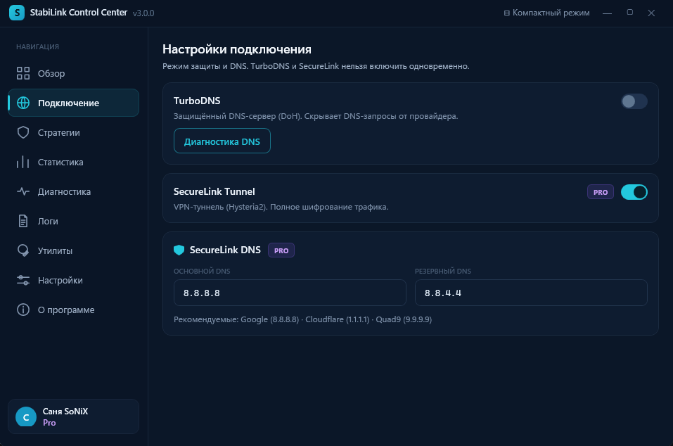
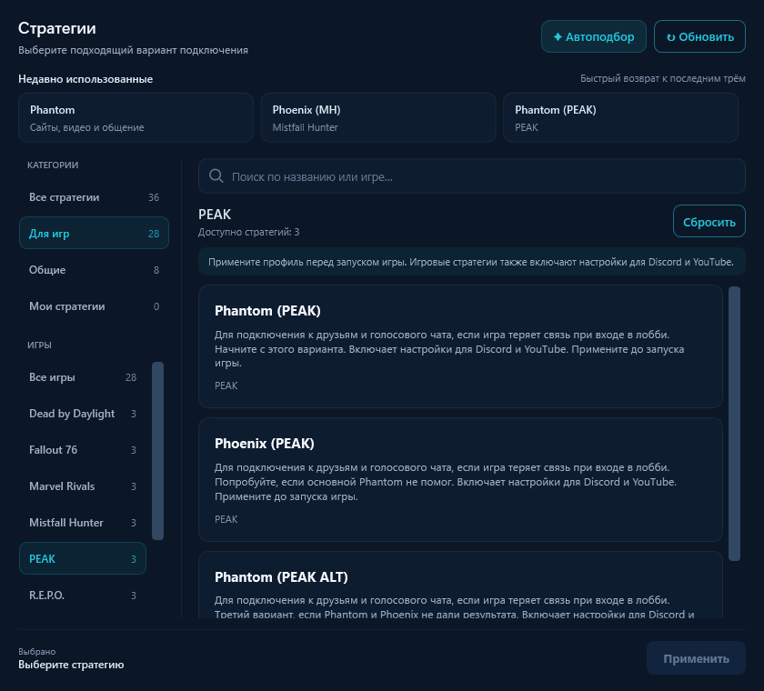

# StabiLink Control Center: полный обзор

[Все руководства](../README.md#docs) · [Игры](../README.md#games) · [Релизы](https://github.com/sany86russ/StabiLink-Desktop/releases/latest) · [Поддержка](../SUPPORT.md)

Содержание

- [Обзор](#обзор)
- [Подключение](#подключение)
- [Стратегии](#стратегии)
- [Статистика](#статистика)
- [Диагностика](#диагностика)
- [Логи](#логи)
- [Утилиты](#утилиты)
- [Настройки](#настройки)
- [Профиль](#профиль)
- [О программе](#о-программе)

Control Center — расширенный режим StabiLink Desktop. Он объединяет управление подключением, стратегиями, статистикой, диагностикой, журналами, утилитами и настройками.

## Обзор

На главном экране находятся:

- состояние системы и активная стратегия;
- большая кнопка включения или выключения оптимизации;
- график входящего и исходящего трафика в реальном времени;
- карточка выбранной стратегии и кнопка её смены;
- быстрые переключатели TurboDNS, Оптимизатора и SecureLink;
- время текущей сессии, отклик, доступность проверяемых сервисов и общий уровень защиты;
- для PRO — блок «Ваш ПК сейчас» с нагрузкой процессора, видеокарты, ОЗУ и историей нагрузки.

График показывает трафик компьютера или SecureLink в зависимости от активного режима. Это индикатор текущей активности сети, а не тест максимальной скорости.

## Подключение

### TurboDNS

Защищённый DNS-режим, который передаёт DNS-запросы через шифрованное соединение. Он помогает скрыть обычные незашифрованные DNS-запросы от локальной сети и провайдера.

- переключатель включает или выключает TurboDNS;
- «Диагностика DNS» проверяет запуск локального DNS-сервиса и разрешение доменных имён;
- можно выбрать Cloudflare, Quad9 или Comss;
- увеличенный кэш сокращает повторные запросы адресов;
- при сбое или смене сети работает автоматическое восстановление;
- TurboDNS доступен FREE и PRO;
- TurboDNS и SecureLink нельзя включать одновременно, поскольку оба режима управляют DNS.

### SecureLink Tunnel

VPN-режим для пользователей PRO. Он создаёт защищённое подключение и направляет поддерживаемый трафик через SecureLink.

- переключатель подключает и отключает VPN;
- режим может работать отдельно или вместе с Оптимизатором;
- совместный запуск одной кнопкой настраивается в разделе «Настройки»;
- при запуске SecureLink активный TurboDNS корректно отключается.

### SecureLink DNS

Поля основного и резервного DNS позволяют выбрать DNS-серверы, используемые внутри VPN-режима.

- основной DNS используется первым;
- резервный применяется при недоступности основного;
- рядом показаны примеры распространённых публичных DNS;
- неверный адрес может привести к проблемам с открытием сайтов, поэтому меняйте значения только осознанно.

### Маршрутизация игр и приложений

Выберите установленную игру, её папку или EXE. Автопоиск находит игровые библиотеки и отсеивает установщики, обновления и отчёты об ошибках. Сохранённые правила проверяются при обновлении. Если VPN уже подключён, новый выбор применяется после следующего подключения — текущая игровая сессия не перезапускается автоматически.

## Стратегии

В v4.2.0 доступны **36 встроенных стратегий: 8 общих и 28 игровых для 9 игр**. Стратегия управляет Оптимизатором трафика; игровой профиль и маршрут SecureLink настраиваются отдельно.

### Категории и поиск

- **«Все стратегии»** — весь каталог.
- **«Для игр»** — выбор игры и её вариантов подключения.
- **«Общие»** — Phantom, Phantom Stealth, Phoenix, Phoenix ALT, Phantom Phoenix, Phantom Phoenix ALT, Vector и Prism.
- **«Мои стратегии»** — пользовательские профили.
- Поиск учитывает название, описание и полное название игры. Запрос `Mistfall Hunter` находит варианты с сокращением MH.
- В узком окне категории и игры представлены компактными списками.
- **«Обновить»** заново получает каталог; **«Применить»** подтверждает выбранную стратегию.

### Игровой каталог

| Игра | Варианты |
|---|---|
| WARDOGS | Phantom (WARDOGS), Phantom (WARDOGS ALT), Phoenix (WARDOGS), Phoenix (WARDOGS ALT) |
| Mistfall Hunter | Phantom (MH), Phoenix (MH), Phantom (MH ALT) |
| PEAK, R.E.P.O., Fallout 76, Rainbow Six Siege, Dead by Daylight, Marvel Rivals, THE FINALS | Для каждой: Phantom (название игры), Phoenix (название игры), Phantom (название игры ALT) |

Все игровые профили доступны FREE и PRO. Они выбираются вручную: **автоподбор сравнивает только 8 общих стратегий**. Примените профиль до запуска игры, затем проверьте вход и матч. Новые профили включают общие настройки Discord и YouTube. THE FINALS ALT сохраняет прямое подключение сервисов игры.

Назначение каждого профиля и симптомы: [каталог игр в README](../README.md#games). Порядок сравнения: [диагностика игрового подключения](MODES.md#games). Наличие профиля не гарантирует работу у любого провайдера и не доказывает причину конкретной ошибки.

### Недавно использованные

Вверху показаны три последние применённые стратегии. История сохраняется после перезапуска; повторное применение поднимает вариант в начало. Нажатие на карточку открывает нужную категорию и выбирает профиль. Чтобы переключиться, нажмите **«Применить»**. Просмотр карточки сам по себе не меняет стратегию; история выбора не является проверкой качества связи.

### Дополнительные настройки Оптимизатора

Предусмотрены автосмена резервного варианта при сбоях, TLS-образец по текущему приложению, запоминание удачных способов для разных сетей и группировка повторных отправок. История обучения хранится зашифрованной на компьютере. Набор функций зависит от стратегии; изменение настроек применяется при следующем запуске Оптимизатора.

Если текущая стратегия работает стабильно, менять её без причины не требуется. Для Discord или YouTube начните с Phantom и при необходимости используйте автоподбор; для игры сравнивайте её варианты по одному.

## Статистика

### Время работы

- текущая сессия — сколько работает активный режим сейчас;
- завершённых сессий — число сохранённых завершённых сеансов;
- всего часов — накопленное время использования.

Время последней проверки, число доступных сервисов и количество замеров помогают понять актуальность результатов. Устаревшие или отсутствующие измерения не выдаются за свежие.

### DNS-резолвинг

Среднее, минимальное и максимальное время получения DNS-ответа. Низкое значение обычно означает быстрый ответ DNS, но само по себе не измеряет скорость загрузки сайта.

### TCP-задержка

Время установления контрольного сетевого соединения. Это оценка отклика, а не пропускной способности.

### Полный отклик сервисов

Показывает время полного контрольного запроса к проверяемым сервисам. Значение включает несколько этапов подключения и поэтому обычно выше простой TCP-задержки.

### Общий VPN-трафик по всем устройствам

Суммарная статистика подписки: Desktop и Sub URL устройства. Она помогает оценить общий объём использования аккаунта, а не только текущего компьютера.

### Управление

- «Проверить сейчас» запускает новую проверку;
- «Экспорт» сохраняет пользовательский отчёт для анализа или поддержки.

## Диагностика

При открытии раздела начинается автоматическая проверка. Вверху показаны общий результат и следующий шаг при обнаруженной проблеме. Проверка сама не перезапускает подключение. Подробности маршрутов и инструменты восстановления раскрываются по необходимости.

### Кэш Discord

Ищет и очищает временные данные Discord, которые иногда мешают подключению после изменения сетевого режима. Личные переписки и аккаунт не удаляются.

### Очистка DNS-кэша

Удаляет устаревшие локальные DNS-записи Windows. Полезно, если сайт перестал открываться после смены DNS или VPN.

### QUIC-кэш браузеров

Проверяет временные сетевые данные поддерживаемых браузеров. Может помочь, если видео или сайт продолжают использовать старое соединение после переключения стратегии.

Перед очисткой закройте браузер, чтобы он не восстановил временные файлы из памяти.

### Файл hosts

Проверяет системный файл hosts на блокирующие или подозрительные записи и создаёт резервную копию перед корректирующим действием.

### Отчёт для поддержки

Создаёт ZIP с диагностической информацией. StabiLink маскирует чувствительные категории данных, но перед отправкой всё равно просмотрите архив и передавайте его только официальной поддержке.

## Логи

Раздел показывает журнал работы приложения и сетевых модулей.

- поиск и фильтры помогают найти нужные события;
- «Обновить» перечитывает файл;
- «Экспорт» сохраняет копию;
- «Очистить логи» удаляет старое содержимое;
- «Открыть папку» открывает каталог журналов;
- интервал автоочистки ограничивает накопление старых записей.

Не публикуйте полный журнал в открытом Issue без просмотра. Используйте встроенный диагностический экспорт.

## Утилиты

### Производительность · PRO

Подготовка ПК к игре одним нажатием: настройки Windows, производительное питание, автоматическая очистка ОЗУ и защита ресурсов игры при фоновой нагрузке. Умный режим учитывает запуск и завершение игры. Процент готовности отражает состояние настроек, а не прирост FPS. При отключении возвращаются изменённые параметры.

Очистка памяти выполняется при включении оптимизации. Автоматическая очистка учитывает реальную нехватку ОЗУ и бережнее обращается с системным кэшем во время игры; ручная очистка доступна отдельно. Дополнительные действия зависят от нагрузки и возможностей ПК. Подсказки о диске установленной игры помогают заметить нехватку места; рекомендация по HDD касается прежде всего загрузки, а не гарантированного прироста FPS.

### Другие утилиты

Раздел также показывает статус лицензирования Windows и Office и предоставляет связанные системные действия.

- верхние карточки показывают обнаруженный статус Windows и Office;
- «Проверка статуса» обновляет сведения;
- остальные пункты запускают отдельные сценарии для выбранного продукта;
- действия с Windows и Office выполняются отдельно от оптимизации ПК и сетевых модулей.

> [!CAUTION]
> Используйте лицензионные функции только для принадлежащей вам копии Windows/Office и при наличии законного права или действующего ключа. StabiLink не предоставляет лицензию Microsoft и не рекомендует обходить условия правообладателя. Публичная документация намеренно не содержит инструкций по несанкционированной активации.

## Настройки

### Запуск в трее

Открывает приложение свёрнутым в системный трей. Для полного завершения используйте «Выход» в меню трея.

### Уведомления

Управляет кастомными popup-сообщениями о запуске и остановке модулей, ошибках и доступных обновлениях.

### VPN вместе с оптимизацией

Опция PRO. Большая кнопка CompactWindow включает и выключает Оптимизатор и SecureLink как единый режим. Если один из модулей не запустился, приложение сообщает об ошибке и сохраняет понятное состояние интерфейса.

### Оптимизация ПК вместе с трафиком · PRO

Подготовка ПК запускается вместе с Оптимизатором трафика. При его отключении настройки ПК возвращаются обратно. Для PRO совместный запуск включён по умолчанию, ранее сохранённый выбор учитывается. Ручное включение в Performance Hub работает независимо.

### Game Filter

Дополнительный режим для игровых и голосовых соединений.

- `TCP + UDP` — универсальный вариант;
- `UDP` — только соединения на основе UDP;
- `TCP` — только TCP-соединения;
- поле портов ограничивает обработку указанными портами или диапазонами;
- пустое поле возвращает стандартный набор портов.

Для большинства пользователей рекомендуется оставить `TCP + UDP` и стандартные порты. Неверно заданный диапазон может ухудшить подключение игры.

### Автозапуск приложения

Запускает StabiLink при входе в Windows. Настройка сохраняется между перезапусками.

### Автозапуск оптимизации

Автоматически включает Оптимизатор после запуска приложения.

### Автозапуск TurboDNS

Автоматически включает защищённый DNS. Не используется одновременно с автозапуском SecureLink.

### Автозапуск SecureLink

Опция PRO. Подключает VPN после запуска StabiLink. Если одновременно выбран TurboDNS, приложение применяет правило несовместимости и не запускает оба режима вместе.

## Профиль

Профиль открывается по карточке пользователя в нижнем левом углу.

В нём доступны:

- имя и тариф;
- срок действия PRO;
- общий трафик;
- состояние VPN-доступа;
- занятые и доступные слоты;
- поиск и сортировка устройств;
- обновление профиля и выход из аккаунта.

Управление Sub URL удобнее выполнять в веб-кабинете, где для каждого слота доступны копирование ссылки и открытие в совместимом клиенте.

## О программе

Показывает текущую версию, ссылки на поддержку и сведения о продукте. При обращении в поддержку всегда указывайте эту версию.
