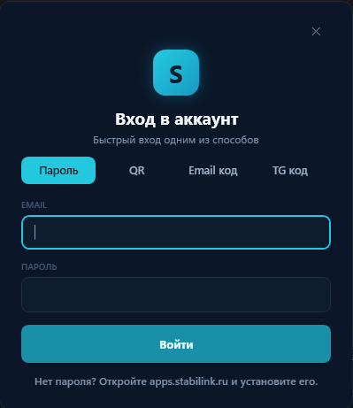
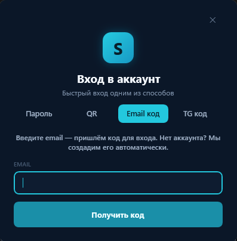
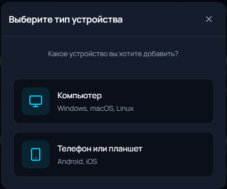
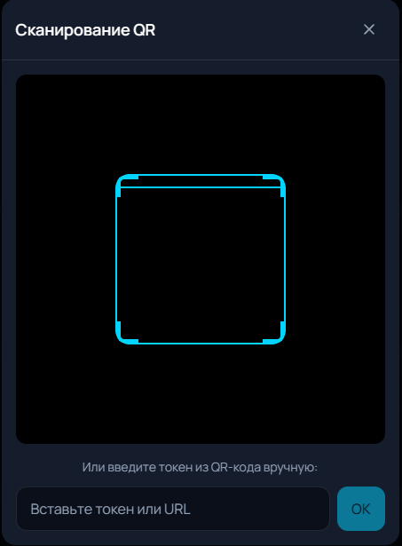
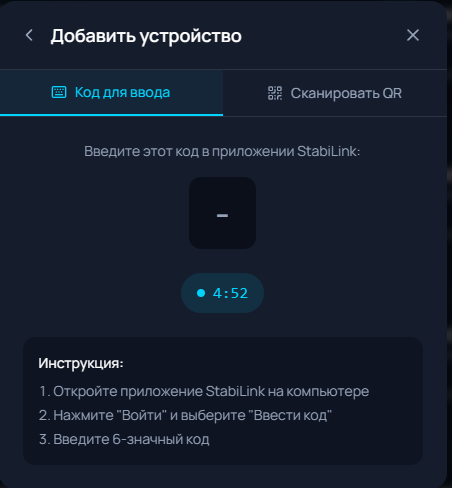
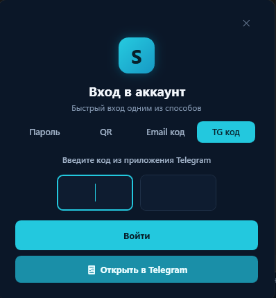

# Первый запуск и авторизация StabiLink Desktop

Вернуться в [главный README](../README.md) · [Установка](INSTALL.md) · [FAQ](FAQ.md)

Инструкция для тех, кто запускает StabiLink впервые.

## Самый короткий путь

Если не хотите разбираться — сделайте так, это работает без предварительной регистрации:

1. Скачайте и распакуйте архив из [последнего релиза](https://github.com/sany86russ/StabiLink-Desktop/releases/latest).
2. Запустите `StabiLink.Desktop.exe` и нажмите «Да» на запрос Windows.
3. В окне входа откройте вкладку **«Email код»**.
4. Введите свою почту и нажмите «Получить код».
5. Введите код из письма.

Аккаунта нет? StabiLink создаст его автоматически — придумывать пароль не нужно. Об этом же говорит и само приложение на этой вкладке.

Остальные разделы — для тех, кому нужны детали.

## 1. Нужно ли сначала регистрироваться?

**Нет, не обязательно.** Для входа в Desktop достаточно вкладки «Email код»: аккаунт создастся сам после подтверждения почты.

Регистрация заранее на [apps.stabilink.ru](https://apps.stabilink.ru) удобна, если вы хотите сразу задать пароль или планируете оплатить PRO и подключить телефон. Личный кабинет доступен и в браузере, и внутри Telegram — это одно и то же место с одним аккаунтом, подпиской и списком устройств:

- в браузере: [apps.stabilink.ru](https://apps.stabilink.ru);
- в Telegram: [@stabilink_bot](https://t.me/stabilink_bot) → кнопка «Личный Кабинет» (или сразу [Mini-App](https://t.me/stabilink_bot/staboffice)).

Telegram не обязателен: всё можно сделать через браузер и почту.

> [!IMPORTANT]
> Не передавайте другим людям пароль, коды входа, QR-коды и персональные Sub URL. Поддержка StabiLink никогда не просит прислать пароль или полную ссылку подписки.

## 2. Скачайте и распакуйте приложение

1. Откройте [последний релиз](https://github.com/sany86russ/StabiLink-Desktop/releases/latest).
2. Скачайте `StabiLink-Desktop-vX.Y.Z-win-x64.zip`.
3. Сверьте SHA-256 со значением в описании релиза — см. [Установка](INSTALL.md).
4. Полностью распакуйте ZIP в отдельную папку.
5. Запустите `StabiLink.Desktop.exe`.
6. Подтвердите запрос прав администратора Windows.

> [!WARNING]
> Не запускайте приложение прямо из ZIP-архива. Windows открывает архив во временной папке, и приложение не сможет нормально работать с сетевыми компонентами, журналами и обновлениями.

## 3. Пройдите приветствие

При первом запуске StabiLink покажет возможности приложения, системные требования и пользовательские условия. Прочитайте условия, поставьте флажок согласия и продолжите.

TurboDNS при первичной настройке намеренно **не включается** — его можно включить позже в разделе «Подключение», когда убедитесь, что обычная оптимизация работает.

## 4. Выберите способ входа

Окно входа содержит четыре вкладки: **«Пароль»**, **«QR»**, **«Email код»** и **«TG код»**. Все они ведут в один и тот же аккаунт — разница только в удобстве.

| Ваша ситуация | Вкладка | Почему |
|---|---|---|
| Впервые открыли StabiLink, аккаунта ещё нет | **Email код** | Аккаунт создастся сам, пароль не нужен |
| Аккаунт уже есть, пароль помните | **Пароль** | Самый быстрый вход |
| Пароль не помните или лень печатать | **Email код** | Новый код на ту же почту |
| Телефон рядом, кабинет уже открыт | **QR** | Не нужно ничего вводить с клавиатуры |
| Пользуетесь ботом в Telegram | **TG код** | Код берётся в кабинете |

### Вкладка «Email код» — рекомендуем для первого входа

1. Откройте вкладку «Email код».
2. Введите действующий email — даже если никогда не регистрировались в StabiLink.
3. Нажмите «Получить код».
4. Откройте письмо от StabiLink и введите код из шести цифр.

Если email используется впервые, аккаунт создастся автоматически. При следующих запусках можно снова ввести ту же почту и получить новый код.

Код действует ограниченное время. Письмо не пришло — проверьте папки «Спам» и «Рассылки» и запросите код заново. Никому не сообщайте полученный код.

### Вкладка «Пароль»

1. Введите email от личного кабинета.
2. Введите пароль.
3. Нажмите «Войти».

Пароля нет? Так бывает, если аккаунт создан автоматически по email-коду или через Telegram. Задайте пароль в личном кабинете на [apps.stabilink.ru](https://apps.stabilink.ru) либо войдите по email-коду. Забыли пароль — [восстановите его](https://apps.stabilink.ru/forgot-password).

### Вкладка «QR»

QR-код в StabiLink — это обычная ссылка. Её открывает **любая камера**, отдельное приложение-сканер не нужно.

**Если телефон под рукой:**

1. Откройте вкладку «QR» и дождитесь появления кода.
2. Наведите на него камеру телефона.
3. Откройте появившуюся ссылку — это страница подтверждения.
4. Сравните эмодзи на телефоне с теми, что показывает Desktop.
5. Подтвердите вход **только при полном совпадении**.

**Если телефона нет:** нажмите кнопку **«🖥 Открыть в браузере на этом ПК»** — страница подтверждения откроется прямо здесь, и телефон вообще не понадобится.

QR действует 5 минут; таймер виден под кодом. Истёк — нажмите «Обновить QR».

> [!CAUTION]
> Эмодзи защищают от подмены. Не подтверждайте вход, если комбинации различаются или если вы сами не запускали добавление устройства.

Подтвердить вход можно и через кабинет: «Устройства» → «Приложение StabiLink» → «Добавить устройство» → «Компьютер / Windows» → «Сканировать QR».

### Вкладка «TG код»

Код состоит из шести цифр и вводится в два поля по три цифры.

1. Откройте личный кабинет: [apps.stabilink.ru/devices](https://apps.stabilink.ru/devices) или [Mini-App в Telegram](https://t.me/stabilink_bot/staboffice).
2. «Устройства» → «Приложение StabiLink» → «Добавить устройство» → «Компьютер / Windows».
3. Откройте вкладку «Код для ввода».
4. В Desktop выберите «TG код» и введите показанные цифры.
5. Нажмите «Войти».

Вкладка называется «TG код» по историческим причинам, но Telegram не нужен: код одинаково выдаётся и в веб-кабинете.

## 5. Первичная настройка после входа

Рекомендуемые значения для большинства:

- Game Filter — оставить включённым;
- TurboDNS — не включать, пока не проверили обычную оптимизацию;
- уведомления — включить;
- запуск в трее — по желанию;
- PRO: «VPN вместе с оптимизацией» — по желанию.

Затем:

1. Убедитесь, что выбрана стратегия **Phantom** — она основная.
2. Нажмите большую кнопку включения.
3. Дождитесь уведомления об успешном запуске.
4. Проверьте нужный сайт, игру или голосовую связь.
5. Не помогло — запустите «Автоподбор».

## 6. Если превышен лимит устройств

FREE — до 2 устройств, PRO — до 5. Компьютер, телефон с приложением StabiLink и **каждый** слот Sub URL занимают по одному месту.

Чтобы освободить место:

1. Откройте «Устройства» в личном кабинете.
2. Найдите старое или неиспользуемое устройство.
3. Удалите или отключите его.
4. Повторите вход на новом компьютере.

## Частые проблемы входа

### Пароль не подходит

Проверьте раскладку клавиатуры и правильность email. Если аккаунт создавался по email-коду, пароля может не быть вообще — войдите по коду или задайте пароль в кабинете.

### QR не сканируется

Увеличьте яркость экрана, протрите объектив камеры, нажмите «Обновить QR». Либо вообще обойдитесь без телефона — кнопка «🖥 Открыть в браузере на этом ПК».

### Код истёк

Коды и QR живут ограниченное время. Запросите новый и вводите только последнее полученное значение.

### Письмо с кодом не приходит

Проверьте «Спам» и «Рассылки», убедитесь в правильности адреса, запросите код повторно ссылкой «Отправить код повторно».

### Устройство не появилось в кабинете

Обновите раздел «Устройства», проверьте лимит тарифа и убедитесь, что подтверждали именно текущую сессию Desktop.

### Telegram недоступен

Telegram не нужен ни для входа, ни для оплаты. Используйте [apps.stabilink.ru](https://apps.stabilink.ru) и вход по email.
