# Karing: подключение телефона к StabiLink

Вернуться в [главный README](../README.md) · [Что такое Sub URL](SUB_URL.md) · [FAQ](FAQ.md)

Пошаговая инструкция со скриншотами: как подключить iPhone или Android к SecureLink VPN через приложение Karing. Рассчитана на тех, кто делает это впервые.

Весь путь занимает около 5 минут. Ничего настраивать вручную не нужно: вы копируете одну ссылку из личного кабинета и вставляете её в Karing.

> [!NOTE]
> Karing — самостоятельное приложение сторонних разработчиков, StabiLink им не управляет. Названия пунктов могут немного отличаться в разных версиях приложения и системы.

## Что нужно до начала

| Требование | Где проверить |
|---|---|
| Аккаунт StabiLink | [apps.stabilink.ru](https://apps.stabilink.ru) |
| Активный тариф PRO | Раздел «Подписка» |
| Свободное место в лимите устройств | Раздел «Устройства» (PRO — до 5) |

SecureLink VPN входит только в PRO. На тарифе FREE подключить телефон через Sub URL не получится.

## Шаг 1. Создайте слот и скопируйте ссылку

Для **каждого** телефона создаётся свой слот. Не используйте одну ссылку на двух устройствах: тогда их нельзя отключить по отдельности и посчитать трафик.

1. Откройте [apps.stabilink.ru/devices](https://apps.stabilink.ru/devices) в браузере или личный кабинет в Telegram: [@stabilink_bot → Личный Кабинет](https://t.me/stabilink_bot/staboffice).
2. Перейдите в «Устройства» → вкладка «Karing / Happ».
3. Нажмите «Создать первый слот» или «Добавить ещё слот».
4. Назовите слот понятно: «iPhone Сани», «Android планшет».
5. Нажмите «Копировать ссылку».

Ссылка выглядит так: `https://api.stabilink.ru/sub/` и длинный код после неё.

> [!WARNING]
> Эта ссылка — ключ от вашего доступа. Не отправляйте её в чаты, скриншоты и GitHub Issues. Любой, кто её получит, сможет пользоваться вашим VPN.

Подробнее про слоты и лимиты: [Sub URL](SUB_URL.md).

## Шаг 2. Установите Karing

Ссылки на официальные версии — в разделе «Загрузки» личного кабинета.

- **iPhone:** App Store.
- **Android:** APK из раздела «Загрузки» либо Google Play.

Не устанавливайте Karing из случайных источников и файлообменников.

---

# Android

## Шаг 3. Пройдите первое открытие Karing

При первом запуске Karing задаст несколько вопросов. Почти везде достаточно нажимать **«Далее»** в правом верхнем углу.

Важны только два ответа:

- **Язык** — выберите «Русский», иначе интерфейс останется английским.
- **Страна или регион** — выберите «RU Российская Федерация». Karing сам предупреждает: неверная страна вызывает проблемы с перенаправлением.

В конце оставьте **«Режим новичка»** включённым и нажмите «Готово».

📱 Показать скриншоты первого открытия (Android)

**1. Согласие с политикой Karing** — «Accept & Continue».

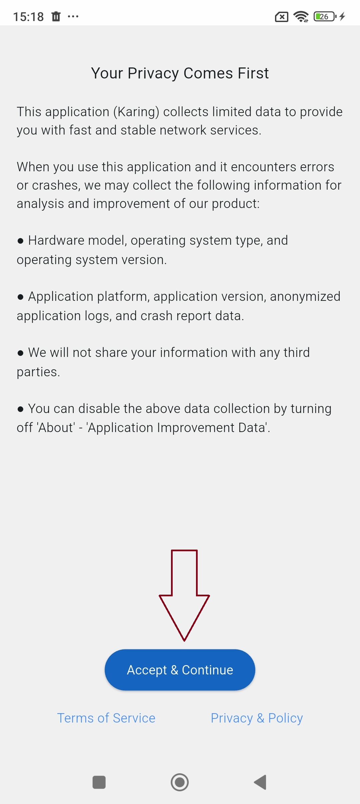

**2. Язык** — выберите «Русский», затем «Далее».

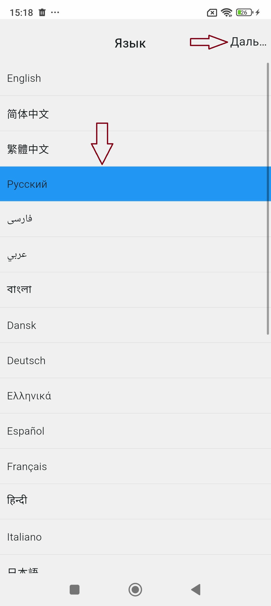

**3. Страна или регион** — «RU Российская Федерация», затем «Далее».

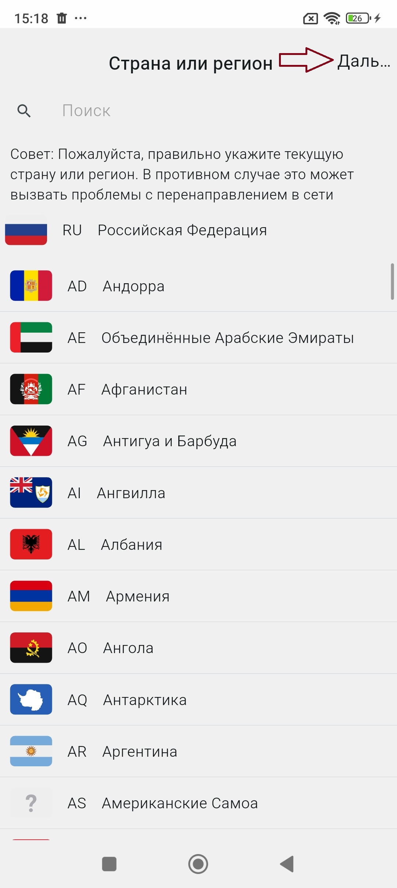

Между этими экранами Karing покажет «TV Настройки» и «Шаблоны для личных правил» — там ничего менять не нужно, просто «Далее».

**4. Режим новичка** — оставьте включённым и нажмите «Готово».

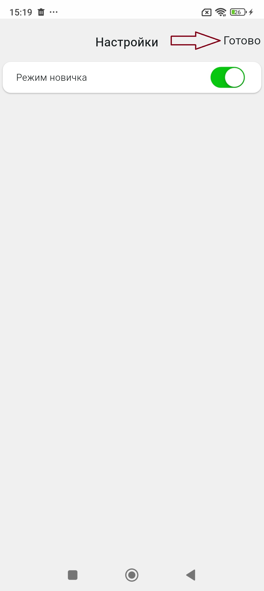

## Шаг 4. Вставьте подписку StabiLink

1. Скопируйте ссылку слота в личном кабинете (шаг 1), если ещё не скопировали.
2. В Karing откройте «Добавить профиль».
3. Нажмите **«Импорт из буфера обмена»**.
4. Karing подставит ссылку сам — проверьте, что поле «Ссылка на подписку/содержание» заполнено.
5. Нажмите **галочку «✓»** в правом верхнем углу.
6. Вернитесь назад стрелкой «‹».

📱 Показать скриншоты импорта (Android)

**5. Импорт из буфера обмена.**

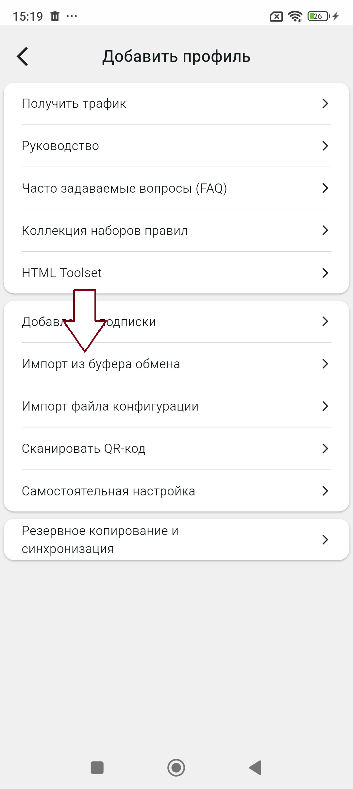

**6. Ссылка подставилась — нажмите «✓».**

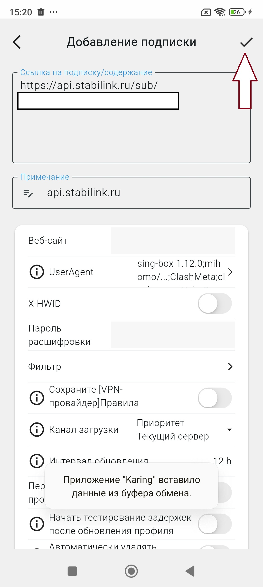

## Шаг 5. Включите VPN

1. На главном экране нажмите круглую кнопку со щитом внизу.
2. Android попросит разрешение на создание VPN-подключения — согласитесь.
3. Щит станет активным, пойдёт время сессии и трафик.

Оставьте «Текущая конфигурация: Автовыбор» — Karing сам выберет самый быстрый сервер. В списке серверов подписка отображается как `api.stabilink.ru` с числом профилей в скобках.

📱 Показать скриншоты подключения (Android)

**7. Кнопка подключения на главном экране.**

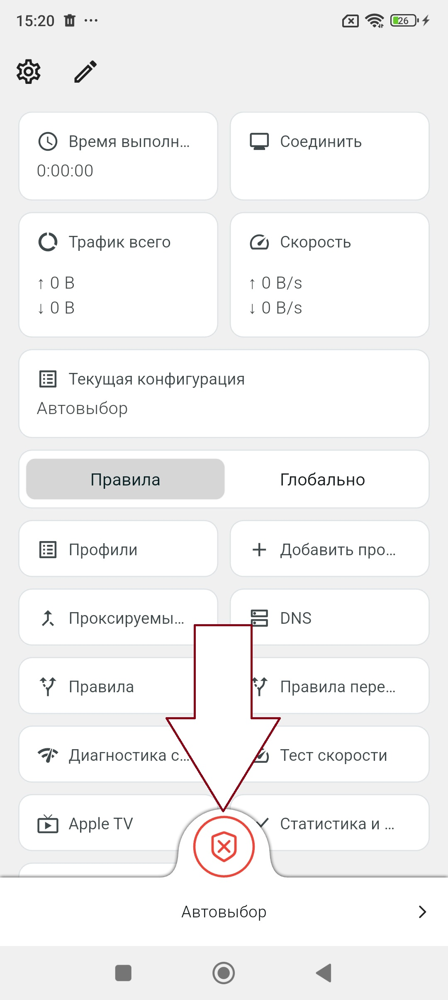

**8. Выбор сервера — оставьте «Автовыбор».**

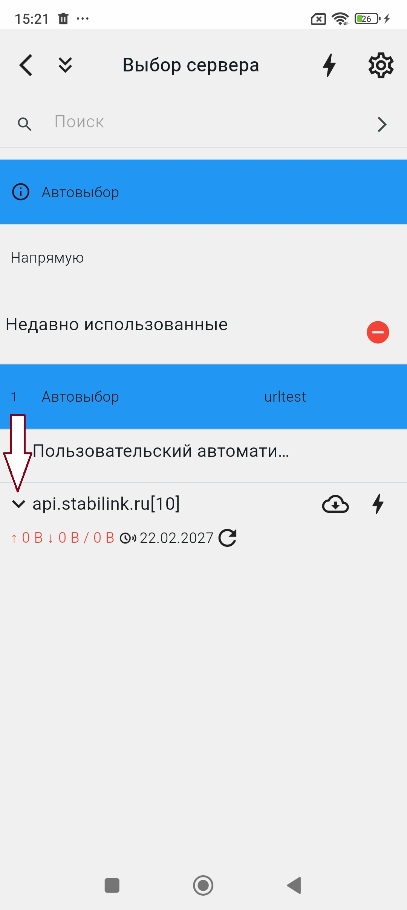

---

# iPhone

Путь тот же, но iOS дополнительно спросит разрешение на вставку из буфера обмена и на добавление VPN-конфигурации.

## Шаг 3. Пройдите первое открытие Karing

Как и на Android: нажимайте «Далее», выберите «Русский» и страну «RU Российская Федерация», оставьте «Режим новичка» включённым.

📱 Показать скриншоты первого открытия (iPhone)

**1. Согласие с политикой Karing** — «Accept & Continue».

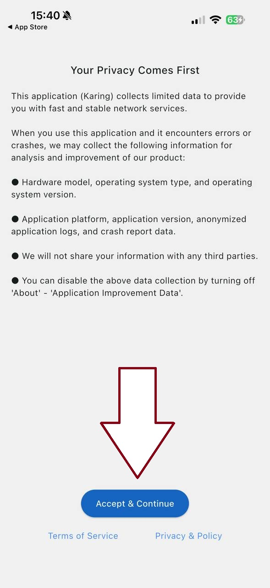

**2. Язык** — «Русский», затем «Далее».

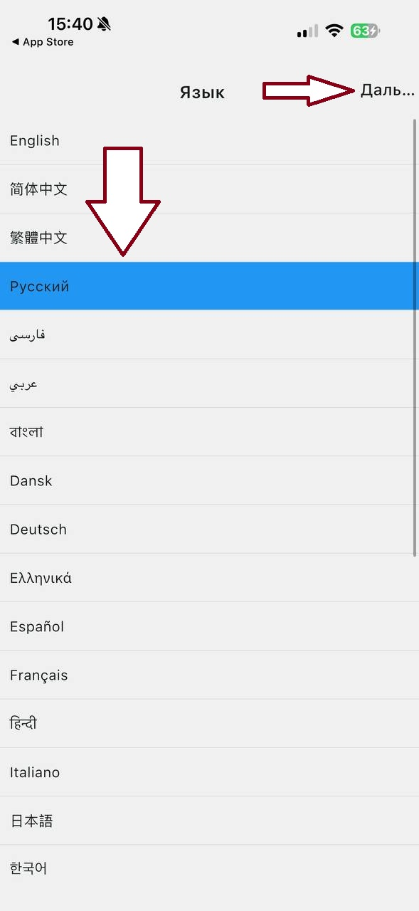

## Шаг 4. Вставьте подписку StabiLink

1. Скопируйте ссылку слота в личном кабинете.
2. В Karing откройте «Добавить профиль» → **«Импорт из буфера обмена»**.
3. iOS спросит разрешение на вставку — нажмите **«Разрешить вставку»**.
4. Проверьте, что ссылка подставилась, и нажмите **галочку «✓»**.
5. Появится «Добавлено успешно» — нажмите «Ок» и вернитесь назад.

📱 Показать скриншоты импорта (iPhone)

**3. Импорт из буфера обмена.**

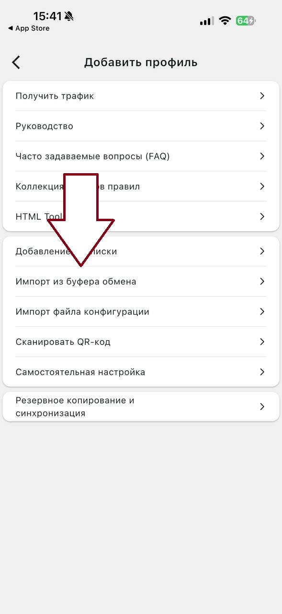

**4. Разрешите вставку** — без этого ссылка не подставится.

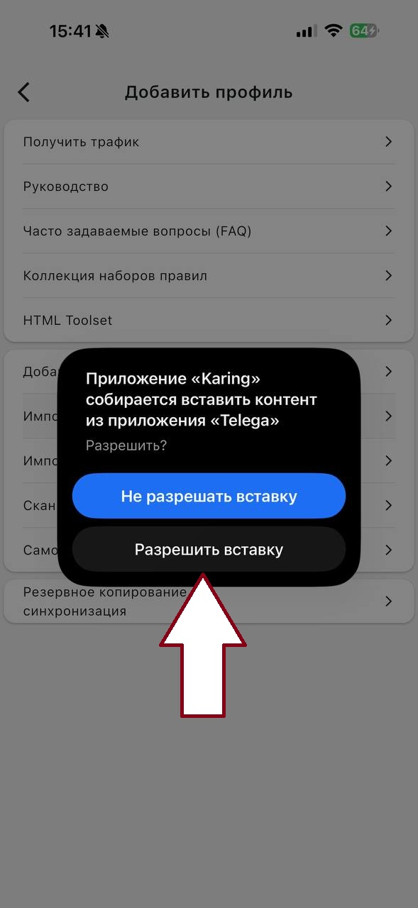

**5. Ссылка подставилась — нажмите «✓».**

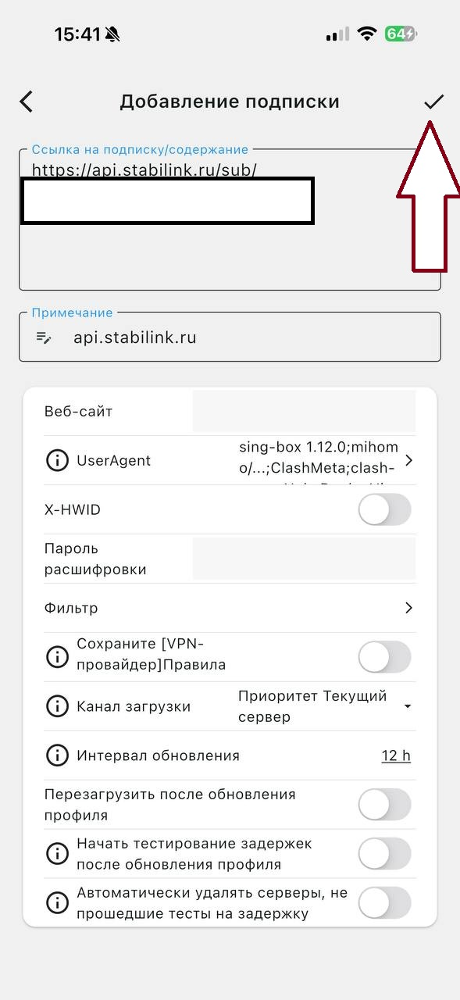

**6. «Добавлено успешно» — нажмите «Ок».**

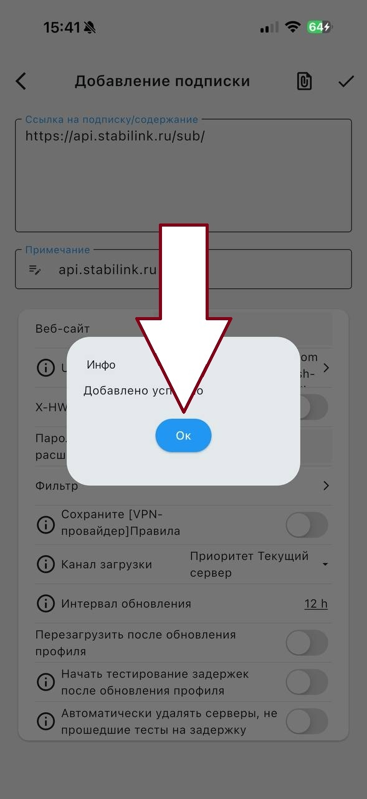

## Шаг 5. Включите VPN

1. Нажмите круглую кнопку со щитом внизу главного экрана.
2. iOS попросит разрешить добавление VPN-конфигурации — согласитесь.
3. Подтвердите Face ID, Touch ID или кодом устройства.

📱 Показать скриншот подключения (iPhone)

**7. Кнопка подключения на главном экране.**

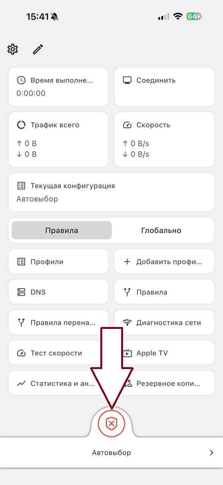

---

## Как проверить, что всё работает

- Щит на главном экране активен, «Время выполнения» идёт.
- «Трафик всего» растёт при открытии сайтов.
- Нужный сервис открывается.

## Если не получилось

| Симптом | Что делать |
|---|---|
| «Импорт из буфера обмена» ничего не подставил | Скопируйте ссылку заново в кабинете. На iPhone нажмите «Разрешить вставку» |
| Профили не появились | Проверьте, что PRO активен и не превышен лимит устройств |
| Было и пропало | Обновите подписку внутри Karing — не создавайте новый слот |
| VPN не включается | Проверьте системное разрешение на VPN-подключение |
| Работает медленно | Оставьте «Автовыбор» либо выберите другой профиль вручную |

Если ничего не помогло — напишите в поддержку: [@stabilink_bot](https://t.me/stabilink_bot). Укажите имя слота, платформу и версию Karing.

> [!WARNING]
> Никогда не присылайте в поддержку и не публикуйте полную ссылку Sub URL — даже её часть после `/sub/`. Имени слота достаточно.

## Смена телефона или потеря устройства

1. Откройте «Устройства» → «Karing / Happ».
2. Удалите или отключите нужный слот.
3. Старая ссылка сразу перестанет работать.
4. Создайте новый слот для нового телефона.

## Полезные ссылки

- Личный кабинет в браузере: [apps.stabilink.ru](https://apps.stabilink.ru)
- Личный кабинет в Telegram: [@stabilink_bot → Личный Кабинет](https://t.me/stabilink_bot/staboffice)
- Интерактивный мастер настройки: [apps.stabilink.ru/setup](https://apps.stabilink.ru/setup)
- Новости StabiLink: [@stabilink](https://t.me/stabilink)
- Сайт: [stabilink.ru](https://stabilink.ru)
