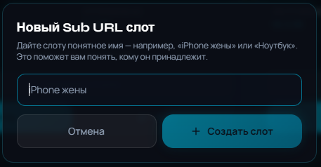
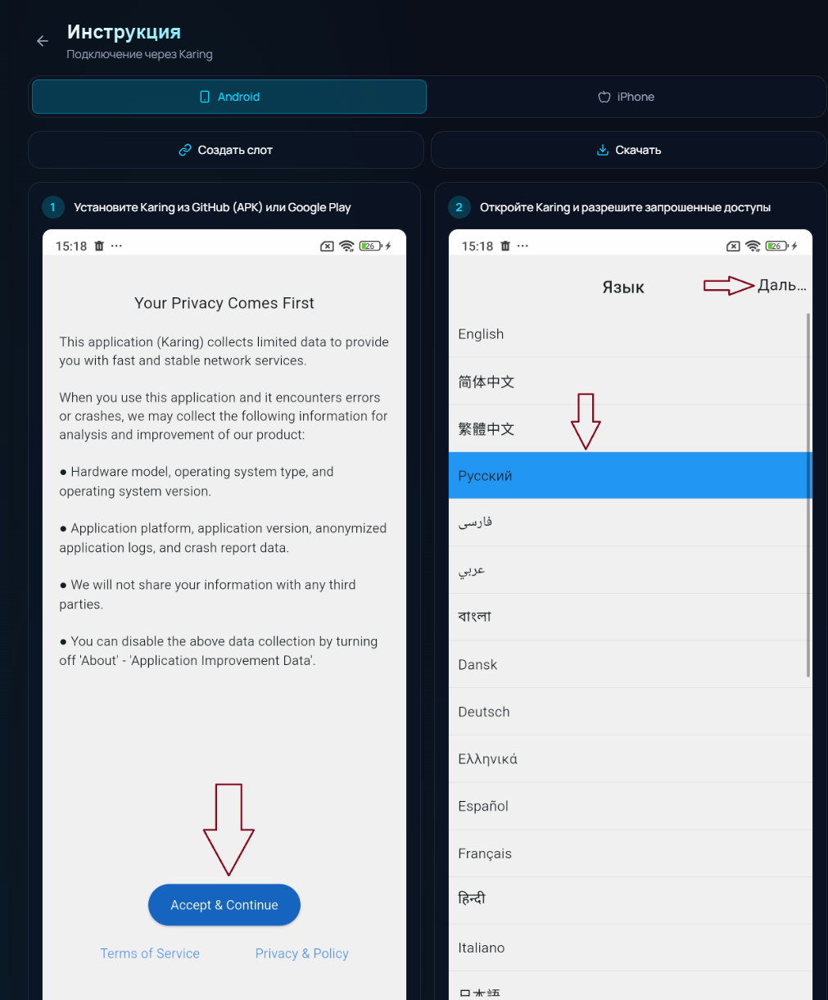

# Sub URL: подключение iPhone и Android

Вернуться в [главный README](../README.md).

Sub URL — персональная ссылка подписки, которую можно импортировать в совместимое VPN-приложение на iOS, Android и других платформах. В StabiLink этот способ предназначен прежде всего для Karing и Happ.

Karing и Happ являются самостоятельными сторонними приложениями. StabiLink не управляет их публикацией, интерфейсом и правилами магазинов; устанавливайте их только из источников, указанных в разделе «Загрузки» личного кабинета или на официальных страницах соответствующих проектов.

## Что потребуется

- аккаунт StabiLink;
- активный тариф PRO;
- свободное место в лимите устройств;
- установленный Karing или Happ.

PRO стоит 99 ₽ за 30 дней при оплате через СБП/банковскую карту либо 70 Telegram Stars внутри Telegram. Тариф включает до 5 устройств. Каждый Sub URL слот занимает одно устройство.

## Почему для каждого телефона нужен отдельный слот

Персональный слот позволяет:

- отдельно отключить потерянный телефон;
- видеть статистику его трафика;
- не ломать подключения других устройств;
- соблюдать общий лимит подписки.

Не пересылайте Sub URL другим людям и не публикуйте его в чатах. Любой, кто получил полную ссылку, может попытаться использовать выделенный вам доступ.

## Создание Sub URL

1. Откройте [apps.stabilink.ru/devices](https://apps.stabilink.ru/devices) или Mini-App через [@stabilink_bot](https://t.me/stabilink_bot).
2. Перейдите в раздел «Устройства».
3. Выберите вкладку «Karing / Happ».
4. Нажмите «Создать первый слот» или «Добавить ещё слот».
5. Назовите слот понятно: например, «iPhone Сани» или «Android планшет».
6. Нажмите «Копировать ссылку» либо кнопку открытия в Karing/Happ.

Имя слота видно только как удобная подпись в вашем кабинете — не вставляйте туда пароль, номер телефона или другие секретные данные.

> [!TIP]
> Актуальный интерактивный мастер для Android и iPhone находится на [apps.stabilink.ru/setup](https://apps.stabilink.ru/setup). В нём можно выбрать платформу, Karing или другой поддерживаемый клиент и пройти шаги в нужном порядке.

## Karing на Android

1. Установите Karing через раздел «Загрузки» личного кабинета.
2. Откройте приложение и предоставьте необходимые системные разрешения.
3. В личном кабинете StabiLink создайте Sub URL слот и скопируйте ссылку.
4. В Karing нажмите `+` и выберите импорт из буфера обмена.
5. Дождитесь появления профилей.
6. При необходимости используйте автовыбор доступного профиля.
7. Нажмите основную кнопку подключения.
8. Разрешите Android создать VPN-подключение.

## Karing на iPhone

1. Установите Karing из App Store через раздел «Загрузки» личного кабинета.
2. Пройдите первичную настройку Karing.
3. Создайте отдельный Sub URL слот в StabiLink.
4. Скопируйте ссылку.
5. В Karing нажмите `+` и импортируйте данные из буфера обмена.
6. Выберите доступный профиль и включите подключение.
7. Разрешите добавление VPN-конфигурации iOS.
8. Подтвердите действие Face ID, Touch ID или кодом устройства.

## Happ

1. Установите Happ через официальный магазин приложений или раздел «Загрузки» StabiLink.
2. Создайте персональный слот во вкладке «Karing / Happ».
3. Нажмите кнопку «Happ» либо скопируйте ссылку вручную.
4. Подтвердите импорт профиля в Happ.
5. Выберите профиль и включите VPN.

Названия пунктов могут немного отличаться между версиями iOS, Android, Karing и Happ.

## Обновление подписки в клиенте

Sub URL является подпиской, а не одноразовым конфигом. Если состав доступных профилей изменился, запустите обновление подписки внутри Karing/Happ. Не создавайте новый слот без необходимости.

## Отключение потерянного устройства

1. Откройте «Устройства» → «Karing / Happ».
2. Найдите нужный слот.
3. Удалите или отключите его.

Старая ссылка перестанет предоставлять доступ. После этого можно создать новый слот для другого устройства.

## Если подключение не работает

- убедитесь, что PRO активен;
- проверьте, не достигнут ли лимит 5 устройств;
- обновите подписку в Karing/Happ;
- удалите только профиль внутри клиента и импортируйте тот же Sub URL повторно;
- проверьте системное разрешение на создание VPN;
- попробуйте другой доступный профиль;
- обратитесь в поддержку, не публикуя полную ссылку.

> [!WARNING]
> Не отправляйте полный Sub URL в GitHub Issues. При обращении в поддержку достаточно имени слота, платформы, версии клиента и описания ошибки.
